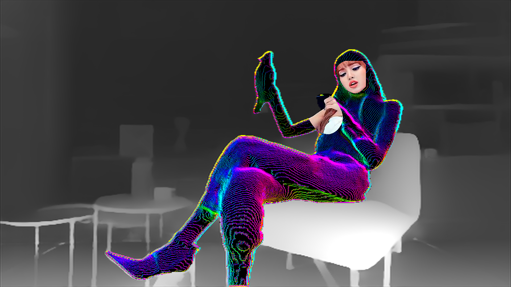
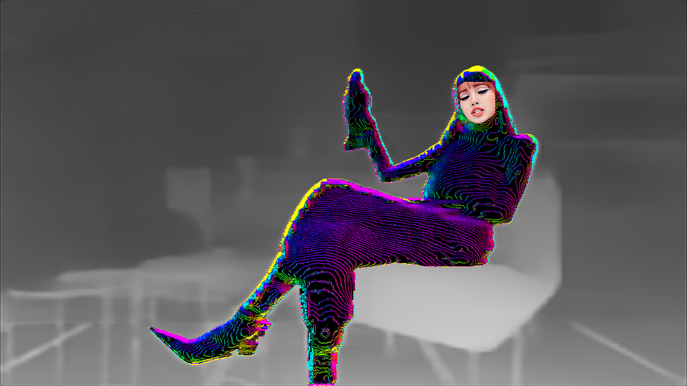
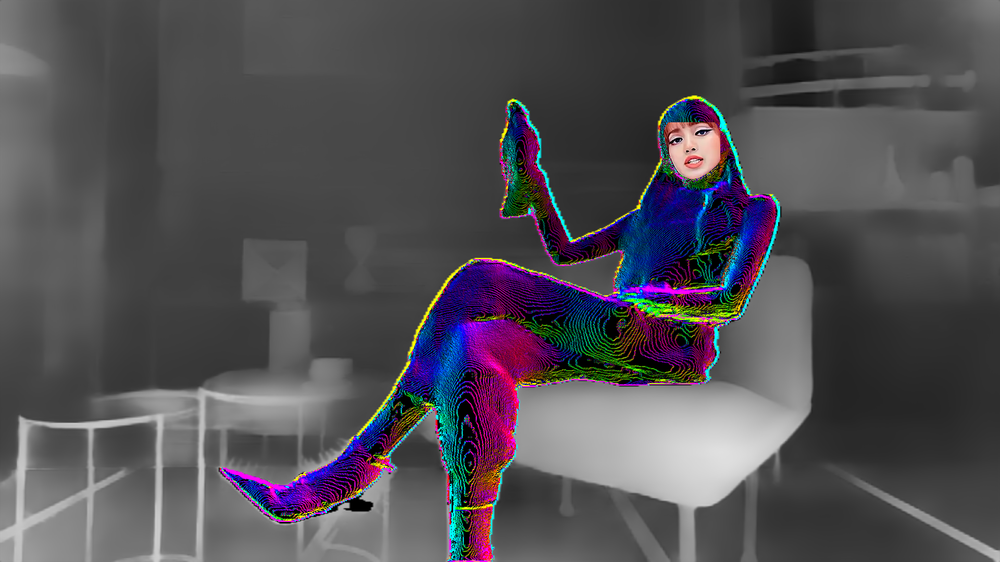

# DepthStudies

DepthStudies collects reproducible Apple-platform depth-model conversions,
runtime artifacts, and measurements used while evaluating depth engines for
MESS.

Start with the [comprehensive 1080p depth application study](studies/1080p-depth-application-study.md).
It follows the workflow from a 1920 x 1080 source image to fixed-shape depth
inference and use alongside face detection and foreground extraction. It
consolidates candidates, optimizations, performance results, quality evidence,
recommended sizes, deployment constraints, and the complete measurement tables.
The existing source reports remain available while the consolidation is reviewed.

The first study and its follow-up optimization work compare fixed-shape Core ML
models executed through MPSGraph on Apple silicon. The tagged release provides
the Core ML source package and ready-to-load `.mpsgraphpackage` archive for each
MESS-integrated variant:

- Depth Anything V2 Small at 448 x 336 with image/FP32 and planar-FP16 graph
  inputs;
- Depth Anything 3 Small at 518 x 518 and 392 x 392; and
- ZipDepth Base NPU at 384 x 384, 512 x 512, 672 x 384, 896 x 512,
  1536 x 864, and 1920 x 1088, including planar-FP16 variants at 384 x 384,
  896 x 512, 1536 x 864, and 1920 x 1088.

See the [artifact manifest](manifests/mpsgraph-depth-models-macos27-v0.1.0.json)
for exact contracts and provenance and the [model build workflows](scripts/README.md)
for end-to-end export and conversion commands. The study's
[source index](studies/1080p-depth-application-study.md#source-index) links the
original performance, optimization, loaded-session, and compatibility reports.

Use the [realtime test TODO list](TEST_TODO_LIST.md) to batch the remaining MESS
comparisons without mixing current app options with experiments that still need
implementation.

Each model family has its own entry point. Depth Anything V2 carries its fixed
source patch and exporter, DA3 pins the tagged conversion fork and its numerical
validator, and ZipDepth carries its pinned exporter. They share only the final
one-package `mpsgraphtool` helper.

## Example frames

These MESS frames show depth-driven contour treatments using the study models.
They are qualitative examples rather than controlled raw-depth
comparisons; the surrounding effect chain contributes to the rendered image.

A seven-frame [fixed-shape sample set](studies/realtime-depth-macos27/findings.md#qualitative-fixed-shape-samples)
also compares ZipDepth at 384 x 384, 512 x 512, 672 x 384, 896 x 512, and the
1920 x 1088 MPSGraph experiment with DA2 at 448 x 336 and DA3 at 518 x 518.
The backend was not recorded for the other six samples.

### Depth Anything V2 Small — Core ML

### Depth Anything V2 Small 448 x 336 FP16 input — MPSGraph

This 1920 x 1080 rendered frame uses the experimental planar FP16 graph input.

### Depth Anything 3 Small 392 x 392 — MPSGraph

### Depth Anything 3 Small 518 x 518 — MPSGraph

### ZipDepth Base NPU — MPSGraph

### ZipDepth Base NPU 896 x 512 — MPSGraph

This 1920 x 1080 rendered frame uses the 896 x 512 fixed model tensor.

### ZipDepth Base NPU 896 x 512 FP16 input — MPSGraph

This 1920 x 1080 rendered frame uses the experimental planar FP16 graph input.

### ZipDepth Base NPU 1536 x 864 — MPSGraph

This 1920 x 1080 rendered frame uses the 1536 x 864 fixed model tensor.

### ZipDepth Base NPU 1536 x 864 FP16 input — MPSGraph

This 1920 x 1080 rendered frame uses the experimental planar FP16 graph input.

### ZipDepth Base NPU 1920 x 1088 — MPSGraph

This 1920 x 1080 rendered frame uses the 1920 x 1088 fixed model tensor.

## Compatibility

The v0.1.0 graph packages were created by Xcode 27.0's `mpsgraphtool`, package
format 7.0.63, with a macOS 27.0 deployment target. Runtime evidence was
collected on an Apple M1 Max running macOS 27.0; the artifact manifest records
which individual variants were exercised. The corresponding `.mlpackage`
archives are included as the exact Core ML inputs used to create those graph
packages. All fourteen Core ML packages support macOS 15: DA2 and ZipDepth
declare the Core ML specification target corresponding to macOS 13, while DA3
declares macOS 15.

The release also includes a macOS 15-targeted serialization of the standard
ZipDepth 896 x 512 graph. On macOS 27 it loaded successfully and produced output
bit-identical to the macOS 27-targeted graph in the comparison harness. It has
not yet been executed on macOS 15, so the encoded deployment target is verified
while oldest-system runtime compatibility remains to be tested.

## Repository scope

Large generated models live in GitHub releases. Git tracks the conversion recipe,
provenance, checksums, licenses, raw diagnostic captures, and derived findings.
MESS continues to generate the graph resources it embeds from its own Core ML
source packages; it does not download this repository's release assets at build
or runtime.

## Licensing

Each model remains subject to its upstream terms. See
[THIRD_PARTY_NOTICES.md](THIRD_PARTY_NOTICES.md) and the files under `licenses/`.
