# From a 1080p image to depth in a realtime application

**Updated:** 2026-09-28 · **Application:** MESS

**Test computer:** Apple M1 Max, macOS 27.0, Xcode 27.0

The question is: **given a 1080p image, which depth model and size work best
when an application also detects faces and extracts the foreground?**

This document brings together the models tested, changes tried, speed results,
example images, recommended sizes, and remaining quality checks. The original
reports are listed in the [source index](#source-index) and remain in place.
The completed application tests take priority over earlier reports that still
say those tests are pending.

Measurements are rounded to whole numbers. Comparisons and recommendations
use the original values, so some rounded times look tied. Exact measurements
remain in the saved logs and source reports.

Model names use the input width: **ZipDepth 672** means the version that takes
a 672-pixel-wide image. Full dimensions appear in the [model reference table](#models-tested).
A [glossary at the bottom](#glossary) explains the abbreviations and technical
terms that remain.

The current speed results suggest:

- **Lowest processing time:** ZipDepth 384 with MPSGraph and 32-bit input,
  taking about **6 ms** in the depth-only application test.
- **First choices to compare for 1080p:** ZipDepth 672 and ZipDepth 896.
  Core ML was fastest for ZipDepth 896 in the depth-only test; MPSGraph is also
  worth testing when faces and foreground extraction run alongside depth.
- **A larger-image option:** ZipDepth 1536 with MPSGraph and 16-bit input,
  taking about **15 ms** in the depth-only test. With face and foreground work
  active, its initial test displayed about **51 fps**.
- **Other model families to compare:** Depth Anything V2 448 and Depth Anything
  3 392, taking about **15–16 ms** with MPSGraph in the depth-only tests.

**We have speed results, but no confirmed winner for combined image quality.**
The conversion checks show that the converted models keep the expected depth
output. Example images show how the effects look. We still need comparisons
using the same frames to judge depth, foreground edges, faces, and stability
when the scene moves.

## Reading guide

1. [How the application uses a 1080p image](#how-the-application-uses-a-1080p-image)
2. [Models tested](#models-tested)
3. [Changes we tried](#changes-we-tried)
4. [How to read the measurements](#how-to-read-the-measurements)
5. [Results](#results)
6. [What we know about quality](#what-we-know-about-quality)
7. [Recommended models and sizes](#recommended-models-and-sizes)
8. [Next steps](#next-steps)
9. [Supported macOS versions and repeating the tests](#supported-macos-versions-and-repeating-the-tests)
10. [Suggested document structure](#suggested-document-structure)

The detailed tables are at the end:
[all depth-only results](#appendix-a-all-depth-only-results),
[all combined-workload results](#appendix-b-all-combined-workload-results),
[model-only tests](#appendix-c-model-only-tests),
[expected hardware use](#appendix-d-expected-hardware-use), and
[output checks](#appendix-e-output-checks).

## How the application uses a 1080p image

The source and final image are 1920 x 1080. Each depth model runs at its own
chosen input size. The application resizes the image, estimates depth, and
fits that result back onto the source image for effects and compositing.

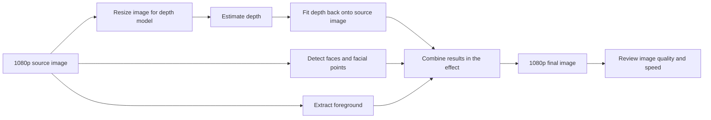

The process has three depth steps:

1. **Prepare the image.** Resize it to the model's input dimensions. Core ML
   takes an image. MPSGraph takes separate red, green, and blue values, stored
   as 16-bit or 32-bit numbers. The converted model handles the required
   scaling and color adjustments.
2. **Estimate depth.** Run the model through Core ML or MPSGraph. Its depth
   image has the same dimensions as the model input and uses 16-bit values.
3. **Apply the effect.** Fit the depth image back onto the 1080p image and use
   it alongside detected faces and the foreground mask. All three results
   need to line up in position, orientation, and time.

The saved example images are confirmed to be 1080p. The logs record the depth
model's dimensions, but do not independently record the original source size
or exactly how it was stretched, cropped, or padded. Those details should be
recorded in the next test batch. The application code lives in MESS; this
repository stores model conversion steps and test results.

Square, 4:3, and wide inputs can treat a 16:9 source differently. Record the
actual resize method and compare images from the same frame. More input
pixels may help detail, but that benefit still needs to be demonstrated.

ZipDepth requires each input dimension to be a multiple of 32. The app's
`ZIP 1080` setting therefore selects **ZipDepth 1920**, whose exact input is
1920 x 1088. ZipDepth 1536 uses an exact 16:9 input and has 37% fewer pixels.
The cost of the largest input mostly comes from processing more pixels; the
eight extra rows account for only a small part of that increase.

## Models tested

Each family uses the same saved model weights across its sizes. These are
size-specific copies of the same trained model. There were 14 MPSGraph
versions and nine Core ML versions in the completed depth-only tests.

| Family | Versions tested | Input types tested with MPSGraph | What the conversion keeps |
| --- | --- | --- | --- |
| Depth Anything V2 Small | 448 | 16-bit and 32-bit | Its existing attention calculation and changes that reduce depth-output processing work |
| Depth Anything 3 Small | 392 and 518 | 32-bit | Its original camera token and attention calculation |
| ZipDepth Base NPU | 384, 512, 672, 896, 1536, and 1920 | 32-bit at all sizes; 16-bit at 384, 896, 1536, and 1920 | Its existing scene-context processing and simplified image-enlargement steps |

All Core ML application versions take an image. Full input dimensions are
listed here so the shorter names remain unambiguous.

| Model name | Input dimensions, width x height | Input pixels | Share of 1080p pixels | Image shape |
| --- | ---: | ---: | ---: | --- |
| Depth Anything V2 448 | 448 x 336 | 150,528 | 7% | 4:3 |
| Depth Anything 3 392 | 392 x 392 | 153,664 | 7% | Square |
| Depth Anything 3 518 | 518 x 518 | 268,324 | 13% | Square |
| ZipDepth 384 | 384 x 384 | 147,456 | 7% | Square |
| ZipDepth 512 | 512 x 512 | 262,144 | 13% | Square |
| ZipDepth 672 | 672 x 384 | 258,048 | 12% | Close to 16:9, adjusted to multiples of 32 |
| ZipDepth 896 | 896 x 512 | 458,752 | 22% | Close to 16:9, adjusted to multiples of 32 |
| ZipDepth 1536 | 1536 x 864 | 1,327,104 | 64% | Exact 16:9 |
| ZipDepth 1920 | 1920 x 1088 | 2,088,960 | 101% | Full-width 1080p option |

ZipDepth 512 and ZipDepth 672 have almost the same pixel count, making them
useful for comparing square and wide inputs. Neither currently has a 16-bit
MPSGraph input version.

In MESS, Depth Anything V2 and Depth Anything 3 use CPU plus GPU for Core ML.
ZipDepth Core ML can use CPU plus Neural Engine when depth has priority, or
CPU plus GPU when foreground/person processing changes that priority. Its
application results include this automatic choice. The logs do not identify
which hardware Core ML actually used for each operation.

The [model manifest](../manifests/mpsgraph-depth-models-macos27-v0.1.0.json)
records exact input/output settings, versions, file checksums, and output
scaling. [Third-party notices](../THIRD_PARTY_NOTICES.md) record model sources
and licenses. Each family has its own depth scale; the raw numbers should not
be compared as though they all measure distance in the same units.

## Changes we tried

The starting models already have fixed input sizes and use 16-bit calculations.
Depth Anything V2 reduces work in the part that produces the depth image.
ZipDepth combines some calculation steps and simplifies how it enlarges an
image. Depth Anything 3 keeps its original camera token and attention behavior.
We have not measured the individual speed benefit of every starting change.

The follow-up tests examined:

| Change | Reason for testing it | Result | Recommendation |
| --- | --- | --- | --- |
| Core ML versus MPSGraph | Find the faster way to run each model in the application | MPSGraph wins most depth-only comparisons; Core ML wins ZipDepth 896 and the typical time for Depth Anything 3 518 | Choose by model size and application workload |
| Smaller or larger inputs | Compare processing time and available detail | The best ZipDepth MPSGraph times range from 6 to 44 ms | Compare a few sizes and check whether extra pixels improve the effect |
| 16-bit MPSGraph input | Halve input-buffer size and remove an input-number conversion | Helps some models and sizes, but not all | Use it for ZipDepth 896 and 1536 when choosing MPSGraph; keep 32-bit for Depth Anything V2, ZipDepth 384, and ZipDepth 1920 |
| A different attention calculation in Depth Anything V2 | Test a built-in attention operation, SDPA | Same output in the tested comparisons, but 2–3% slower through Core ML and 4–5% slower through MPSGraph | Keep the original calculation; the candidate was not added to the app |
| Different hardware choices for Depth Anything 3 | Compare CPU + GPU, CPU + Neural Engine, and all available devices | At size 392, Neural Engine and all-device options were 25% and 23% slower | Keep CPU + GPU; testing size 518 did not advance |
| Core ML's hardware-use estimates | Check the assumption that some work was unexpectedly falling back to CPU | Estimates already assign most work to Neural Engine | Use measured times to make the decision |
| Removing ZipDepth scene-context parts | Test whether those parts cause the expected hardware problem | The hardware-use estimates did not show that problem | Put this experiment on hold; no speed or quality result exists for it |

Changing the input to 16-bit halves the **input buffer**, rather than the
whole app's memory use. Model calculations and depth output already use
16-bit numbers. The application logs do not separately measure input packing,
other preparation steps, or total memory use.

| Model | 32-bit input bytes | 16-bit input bytes | Typical full depth time: 32-bit → 16-bit | Result |
| --- | ---: | ---: | --- | --- |
| Depth Anything V2 448 | 1,806,336 | 903,168 | 15 → 15 ms | Tied; keep 32-bit |
| ZipDepth 384 | 1,769,472 | 884,736 | 6 → 6 ms | 16-bit is 10% slower before rounding; keep 32-bit |
| ZipDepth 896 | 5,505,024 | 2,752,512 | 13 → 12 ms | 16-bit is 9% faster with MPSGraph; Core ML still wins the depth-only test at 11 ms |
| ZipDepth 1536 | 15,925,248 | 7,962,624 | 15 → 15 ms | Similar typical times; slower readings improve from 21 to 16 ms, and the slowest from 25 to 17 ms |
| ZipDepth 1920 | 25,067,520 | 12,533,760 | 44 → 45 ms | Similar typical times; keep 32-bit based on time and display rate |

The model-only tests initially showed a 28–36% improvement for ZipDepth 384
with 16-bit input. The application test reversed that result. The larger
model-only tests were effectively tied, while some application tests improved.
Measuring the full depth process is therefore necessary.

The ZipDepth 896 comparison also uses different package targets: its 32-bit
MPSGraph package targets macOS 15, while its 16-bit package targets macOS 27.
A separate check found identical output and similar speed on macOS 27, but
input precision is not the only difference between those two app packages.

## How to read the measurements

The main application tests ran on 2026-09-28 on an M1 Max, macOS 27.0, and
Xcode 27.0 build 27A266a. Earlier runs date to 2026-09-25. The hardware reports
identify the computer as Mac Studio `Mac13,1` and the macOS build as 26A428.
Individual combined-workload logs do not include the full computer or app
version details.

There are three kinds of timing tests:

| Test | What ran | What it tells us |
| --- | --- | --- |
| Depth-only application test | Release build; same saved video segment, 1080p output, 60 fps target, and one identical depth effect; faces and foreground work off; fresh launch, warm-up, at least 20 seconds logged, and one saved image | Compares the full depth process under controlled conditions |
| Combined-workload application test | Depth, foreground, and face processing active; model, input size/type, MPSGraph, MPSMediaPipe face processing, and 60 fps target recorded | Shows initial behavior under load; exact source/effect settings, comparison images, memory, and full computer/app versions are missing |
| Model-only test | Same input and alternating test order; wait for each result before timing the next call | Compares model execution; preparation, data transfer, and test-program overhead differ from the app |

**Model time** measures running the model. MPSGraph's measurement can also
include waiting for earlier image preparation. **Full depth time** measures
from the app starting a depth request until the result is ready, including
finishing its GPU work. It does not measure the entire face, foreground, and
rendering process together.

The log records the latest times about once per second. The first reading
before one second is excluded. Model time and full depth time are recorded
independently, so their middle values can sometimes appear in an unexpected
order. The saved depth fields use `1000 / operation_ms`; the summary script
converts them back to milliseconds before calculating the reported values.

- **Typical time** is the median: half the recorded readings are at or below it.
- **Slower readings (p90)** show the time that 90% of readings are at or below.
- **Slowest readings (p99)** show the time that 99% of readings are at or below.

These percentages describe the sampled readings, rather than every individual
depth request. Each app run has only tens of readings, so p99 is an estimate
based on a small sample.

**The display rate and depth update rate are different.** A display running at
60 fps can reuse an older depth result. The logs do not yet count how many new
depth results arrive or how many requests are replaced by newer ones. They
therefore cannot establish a fresh-depth frame rate or explain scheduling
behavior. The display rate is a rolling 60-frame average sampled once per second.

Core ML's hardware-use reports are another kind of evidence. They predict
which hardware is preferred, with estimated shares of work. They do not run the
model or measure its time. Appendix D keeps those estimates separate.

## Results

### Depth-only application results

All 23 accepted tests finished normally, lost no log events, recorded no face
or foreground timings, and saved a 1080p image. Each row below selects the
method with the lowest typical **full depth time** for that model and size.

| Model | Fastest tested method | Typical | Slower (p90) | Slowest (p99) | Finding |
| --- | --- | ---: | ---: | ---: | --- |
| Depth Anything V2 448 | MPSGraph, 32-bit input | 15 ms | 16 ms | 16 ms | 8% faster than Core ML; 16-bit input tied |
| Depth Anything 3 392 | MPSGraph, 32-bit input | 16 ms | 16 ms | 18 ms | 6% faster than Core ML |
| Depth Anything 3 518 | Core ML | 49 ms | 55 ms | 61 ms | 2% lower typical time than MPSGraph; MPSGraph has better slower readings |
| ZipDepth 384 | MPSGraph, 32-bit input | 6 ms | 6 ms | 7 ms | Lowest depth processing time in the table |
| ZipDepth 512 | MPSGraph, 32-bit input | 8 ms | 8 ms | 9 ms | 31% faster than Core ML |
| ZipDepth 672 | MPSGraph, 32-bit input | 8 ms | 9 ms | 9 ms | Wide input; 24% faster than Core ML |
| ZipDepth 896 | Core ML | 11 ms | 12 ms | 12 ms | Core ML wins; 16-bit input is the better MPSGraph option |
| ZipDepth 1536 | MPSGraph, 16-bit input | 15 ms | 16 ms | 17 ms | 57% faster than Core ML; more consistent than 32-bit input |
| ZipDepth 1920 | MPSGraph, 32-bit input | 44 ms | 47 ms | 53 ms | 28% faster than Core ML, but costly for frequent depth updates |

Depth Anything V2 448 with Core ML provides the older-macOS alternative at
17 / 18 / 21 ms. Depth Anything 3 518 with MPSGraph takes 50 / 53 / 54 ms:
slightly slower typically, but better on its slower readings. For ZipDepth 896,
MPSGraph takes 12 / 13 / 13 ms with 16-bit input and 13 / 13 / 17 ms with
32-bit input. These sets are typical / p90 / p99 times.

At 60 fps, there are about 17 ms between displayed frames. Several depth-only
times fit that interval. Face/foreground work, occasional slow results, and
reusing older depth results still affect the full application.

### Depth, faces, and foreground together

Eight later runs record the model and input settings. All use MPSGraph for
depth and have active face and foreground processing.

| Model | Typical full depth time: 32-bit / 16-bit | Display rate: 32-bit / 16-bit | Finding |
| --- | --- | --- | --- |
| Depth Anything V2 448 | 30 / 30 ms | 58 / 58 fps | Input types tied |
| ZipDepth 512 | 7 / not tested ms | 60 / not tested fps | Foreground processing takes about 22 ms |
| ZipDepth 672 | 6 / not tested ms | 60 / not tested fps | Foreground processing takes about 18 ms |
| ZipDepth 896 | 9 / 8 ms | 60 / 60 fps | 16-bit typical time is 6% lower; slower readings are worse |
| ZipDepth 1536 | 29 / 28 ms | 51 / 51 fps | 16-bit typical time is 4% lower; slower readings are similar |

Some combined-workload times are lower than the depth-only times. The batches
lack the same recorded source and complete settings, so we cannot conclude
that adding face and foreground work makes depth faster. We also cannot rank
ZipDepth 512 against ZipDepth 672 from these runs: their foreground workload
differed.

For ZipDepth 896 with 16-bit input, p90 increased from 9 to 10 ms and p99 from
9 to 13 ms. Repeat the comparison under the same conditions. There is no
matching combined-workload Core ML result for ZipDepth 896, so its best method
under that workload remains undecided.

ZipDepth 1536 shows why the combined test matters. A model taking about 15 ms
on its own took about 28 ms under the recorded workload, while display rate
fell near 51 fps. Any added image detail needs to justify that cost.

Three older runs remain in Appendix B. Their model families were named by the
user, but their exact input sizes and types were not logged. They provide
background rather than a size recommendation.

## What we know about quality

There are three separate questions:

| Question | Evidence so far | Conclusion |
| --- | --- | --- |
| Does a conversion or change keep the model's expected output? | Repeatable input patterns and comparisons of the resulting depth values | Tested candidates passed their output checks, including some rejected for speed |
| Does the depth make a useful effect? | Contour examples and 23 depth-only images at 1080p | Useful examples, but no scored quality ranking between models |
| Do depth, faces, and foreground work well together, including motion? | Processing times from runs with all three active | Quality still needs review using the same frames and video segments |

Matching a model's output does not prove that its depth is accurate in the real
scene. Face and foreground processing times do not measure detection or mask
quality. There are no recorded scores against known depth, reference masks,
annotated faces, or expected stability during motion. The detailed output
checks are preserved in [Appendix E](#appendix-e-output-checks).

### Example images

These depth-only tests use the same depth effect. They show the rendered
result, rather than the depth map or a completed face/foreground/depth
comparison. All 23 images are embedded in Appendix A. Earlier free-form
examples remain in the README and source reports.

| Model and method | 1080p image from the depth-only test |
| --- | --- |
| ZipDepth 384, MPSGraph FP32 | 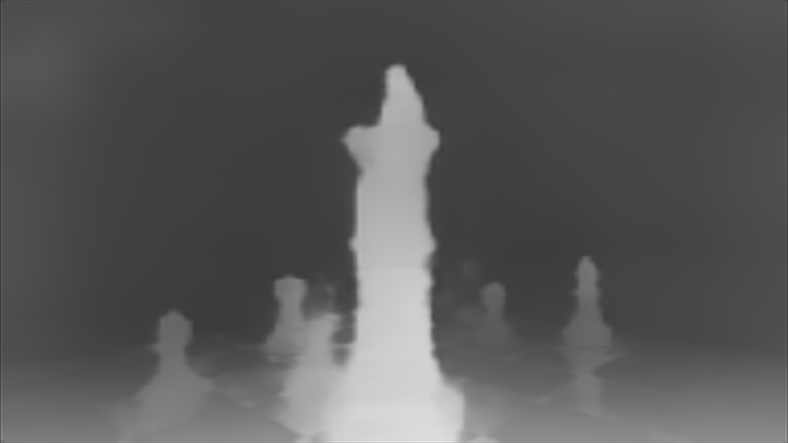 |
| ZipDepth 672, MPSGraph FP32 | 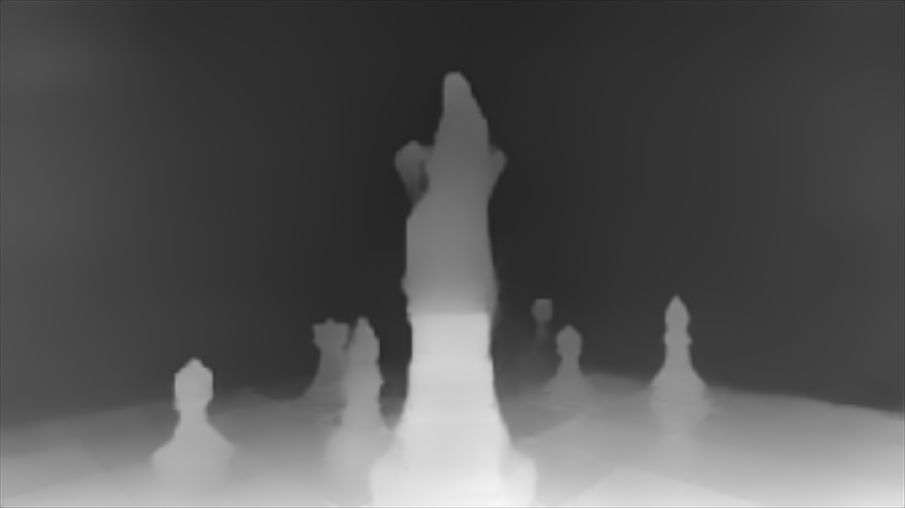 |
| ZipDepth 896, Core ML |  |
| ZipDepth 1536, MPSGraph FP16 | 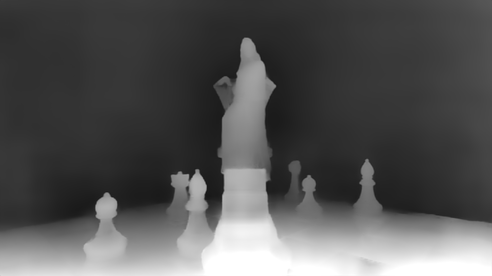 |
| Depth Anything V2 448, MPSGraph FP32 |  |
| Depth Anything 3 392, MPSGraph FP32 | 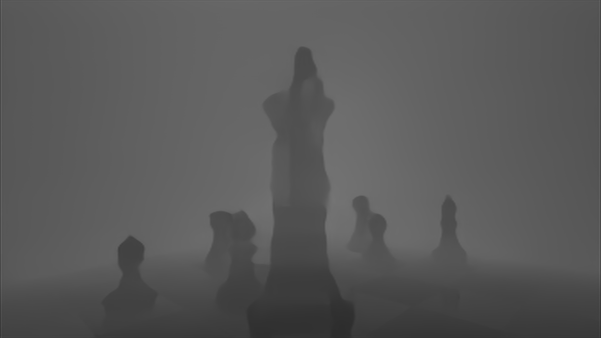 |

### Quality review for the next tests

Use the same 1080p frames and effect settings for every finalist. Include close
faces, multiple people, hair, hands, thin edges, overlapping subjects, low
contrast, and movement. Save the source image, depth map, foreground mask,
face boxes and facial points, final image, and a short comparison video.
Display depth maps consistently and record any adjustment to the model's
output scale or effect settings.

| Area | What to check | What to save |
| --- | --- | --- |
| Depth | Correct near/far ordering and separation of overlapping subjects | Matching depth maps with notes; add an accuracy score if known depth is available |
| Foreground edges | Hair, hands, thin objects, missing mask areas, halos, and disagreement with depth | Enlarged matching crops; use mask overlap (IoU) and edge scores if reference masks exist |
| Faces | Missed faces, misplaced boxes or facial points, and the effect around faces | Face counts and marked images of the same frames; compare with annotations if available |
| Motion | Depth flicker, changing masks, shaky facial points, and delays between results | Matching videos, result times, and notes about visible problems |
| Final effect | Clear contours, subject separation, edge bleed, and consistent appearance at 1080p | Full-resolution final images using the same settings |

Mark each area **pass**, **minor issue**, or **fail**, with a frame/time and a
reason. This is a proposed review method; no scores have been assigned. Keep
these notes beside the speed results so any extra processing cost has a clear
visual benefit.

## Recommended models and sizes

These choices narrow the next comparisons. They do not change a MESS default
or claim that an unreviewed image is better.

| Need | Candidate | Why compare it | What remains |
| --- | --- | --- | --- |
| Lowest processing time | ZipDepth 384, MPSGraph with 32-bit input | Fastest depth-only result at 6 ms | Check subject/edge detail and test with faces and foreground active |
| Wide input at low cost | ZipDepth 672, MPSGraph with 32-bit input | 8 ms depth-only time; initial combined run near 60 fps | Compare image quality and repeat with controlled face/foreground settings |
| More input detail at modest cost | ZipDepth 896, Core ML plus MPSGraph with 16-bit input | Core ML wins depth-only at 11 ms; the MPSGraph option held 60 fps in an initial combined run | Compare both methods under identical load and repeat the slower-time readings |
| Larger depth image | ZipDepth 1536, MPSGraph with 16-bit input | Exact 16:9; 15 ms depth-only time and more consistent than 32-bit input | Show an image-quality benefit and decide whether roughly 51 fps under load is acceptable |
| Full-width reference | ZipDepth 1920, MPSGraph with 32-bit input | Best result at that size, 44 ms | Keep as an optional comparison until its visual benefit justifies the cost |
| Other model behavior | Depth Anything V2 448 and Depth Anything 3 392, MPSGraph with 32-bit input | Around 15–16 ms depth-only time | Compare against ZipDepth on the same scenes; a recorded-size combined run for Depth Anything 3 is missing |
| Older macOS support | Existing Core ML image-input versions | All released models support a macOS 15 app target | Test the oldest claimed macOS version; current timings come from macOS 27 |

Start with **ZipDepth 672 and ZipDepth 896**. Keep ZipDepth 384 as the fast
reference and ZipDepth 1536 as the larger-image option. ZipDepth 512 is useful
if square input suits the image preparation or produces a preferable result;
its current timing does not establish a quality benefit over ZipDepth 672.
Include the two Depth Anything families when comparing different depth behavior.

Depth Anything 3 518 and ZipDepth 1920 cost much more than a 17 ms frame
interval, even when the display stays near 60 fps. Their visual benefit needs
to justify less frequent fresh depth results.

## Next steps

The controlled depth-only tests are complete. The next milestone is a
**controlled comparison with faces and foreground active, using matching
images and videos for quality review**.

1. **Record the settings.** Save the computer, macOS/Xcode versions, MESS and
   bundle versions, model checksums, source size and video segment, resize
   method, output size, target fps, effect, face/foreground settings, and
   warm-up process. The current checklist specifies MESS commit `b4628f1243`
   and bundle commit `095b1d5`, or a later version with the same logging and
   macOS-15 ZipDepth 896 support.
2. **Compare the finalists under the same load.** Test ZipDepth 672 with
   MPSGraph, ZipDepth 896 with Core ML and 16-bit MPSGraph input, and ZipDepth
   1536 with both input types. Include the other references if image review
   makes them finalists. Relaunch the app for each method, let it settle,
   log at least 20 seconds, and repeat close or surprising pairs in reverse
   order.
3. **Save the images and video.** Keep a rendered image during each log and
   the separate depth, face, and foreground results. Record visible problems.
   Existing combined runs lack matching images and complete source/effect
   settings, so they do not complete this step.
4. **Measure the missing information.** Record app memory use. Add counts of
   completed depth results and requests replaced by newer ones, plus the age
   of the depth used for each effect. Separately timing image resizing, input
   preparation, the model, and fitting the output back to 1080p would help
   explain where 16-bit input saves time. Record CPU/GPU use and the time for
   the complete rendered result.
5. **Choose and document the result.** Mark each finalist `adopt`,
   `retain as optional`, or `reject`, based on images, depth times, occasional
   slow results, display rate, fresh-depth rate when available, and memory.

Other experiments can wait until they answer a remaining application question:

| Experiment | Status |
| --- | --- |
| Depth Anything 3 392 with 16-bit MPSGraph input | Not built or measured; check output and speed before adding it to the app; try 518 only if 392 succeeds |
| Depth Anything V2 with 16-bit Core ML input and Neural Engine | The test program needs a hardware-choice option; no matching app version exists |
| Removing ZipDepth scene-context parts | On hold until measured hardware behavior or a quality question justifies changing the model |
| Depth Anything 3 448 | Not built; consider it if image comparisons show a useful gap between 392 and 518 |
| Depth Anything MPSGraph on older macOS | A different conversion of its normalization step has not been implemented or tested |

Repeat the rejected attention and hardware-choice tests only after a relevant
Core ML or MPSGraph update or a new question. Retraining, compressing weights
without a measured need, and redesigning the request scheduler are outside this study.
The [test checklist](../TEST_TODO_LIST.md) keeps the exact app labels and tasks.

## Supported macOS versions and repeating the tests

### macOS support

A model's declared minimum macOS version, its converted package target, and
the versions actually tested are separate. Most timings here come from
macOS 27 on the M1 Max. A declared older target still needs testing there.

| Model file | Declared minimum or target | What was checked |
| --- | --- | --- |
| Depth Anything V2 and ZipDepth Core ML | macOS 13 model minimum; usable in a macOS 15 app | Uses the iOS 16/macOS 13 model format; older-system tests remain separate |
| Depth Anything 3 Core ML | macOS 15 | Uses the iOS 18/macOS 15 model format |
| Released Depth Anything MPSGraph | macOS 27 | Conversion works for 27; tested targets 26 and 15 fail |
| Standard released ZipDepth MPSGraph | macOS 27 study target | This is a release choice; tested 384 and 896 conversions also work for older targets |
| Alternate ZipDepth 896 MPSGraph with 32-bit input | macOS 15 target | Loads and gives the expected output on macOS 27; has not run on macOS 15 |

The tested converter is Xcode 27.0's `mpsgraphtool`, using package format
7.0.63. The Depth Anything conversion creates a normalization operation,
`mps.instance_norm`, with settings that require package target 1.3.8.
The converter chooses 1.3.3 for macOS 26 and 1.2.1 for macOS 15, which cannot
store that form of the operation. This affects those MPSGraph files, rather
than their Core ML equivalents. Debug or Release mode does not change the
required package target.

The macOS-15 ZipDepth 896 package produced exactly the same output as the
macOS-27 package when checked on macOS 27. Both took about 6 ms in a small
model-only test with 30 alternating calls after five warm-up calls. This was
an output/compatibility check, rather than a speed ranking. See the
[raw comparison](realtime-depth-macos27/compatibility/zipdepth-896x512-macos15-vs-macos27.json)
and [macOS compatibility report](realtime-depth-macos27/compatibility.md).

### Repeat the builds and tests

The repository stores conversion instructions, saved logs, output checks,
file checksums, and licenses. Large model files live in releases. Each of the
fourteen released versions has Core ML and macOS-27 MPSGraph archives, plus
the separate macOS-15 ZipDepth 896 package. MESS creates its embedded MPSGraph
files from its own Core ML models.

Run model-specific build scripts from the repository root, for example:

```sh
scripts/models/depth-anything-v2/build.sh
scripts/models/depth-anything-3/build_392.sh
scripts/models/zipdepth/build_672x384.sh
scripts/models/zipdepth/build_896x512.sh
scripts/models/zipdepth/build_1536x864_tensor_f16.sh
```

The scripts use fixed source and weight versions, verify file checksums, and
record model settings, required Python packages, and macOS targets. They share
the final conversion helper and refuse to replace existing model outputs.
Generated files go in the ignored `build/` directory. See the
[build instructions](../scripts/README.md) and each model's instructions for
other sizes and output-check commands.

Summarize a saved application run without starting MESS:

```sh
python3 scripts/summarize_capture.py \
  studies/realtime-depth-macos27/captures/ZIP_1536x864_MPSGRAPH_FP16_CLEAN
```

The [MPSGraph comparison tool](../scripts/tools/mpsgraph-depth-compare/README.md)
checks output and model-only speed. The
[Core ML hardware-report tool](../scripts/tools/coreml-compute-plan/README.md)
repeats the hardware-use estimates. The
[Depth Anything 3 build instructions](../scripts/models/depth-anything-3/README.md)
include its fixed-hardware test command. Individual experiment reports link
the original JSON results, test inputs, package versions, and test procedures.

Depth Anything V2 Small and Depth Anything 3 Small retain Apache-2.0 terms;
ZipDepth Base NPU retains MIT terms. See the
[third-party notices](../THIRD_PARTY_NOTICES.md) and included licenses.

## Suggested document structure

Keep one main study that tells the application story, supported by:

| Document or folder | Role |
| --- | --- |
| `README.md` | Short introduction, link to this study, build/model links, and a few images |
| This study | Workflow, models, changes, results, quality review, recommendations, and detailed tables |
| `TEST_TODO_LIST.md` | Steps for running tests and exact app settings |
| Model instructions under `scripts/` | Build and output-check commands |
| `manifests/` and saved test folders | Exact model details and original evidence |
| Original findings and plans | Preserved experiment history during review |

Some earlier reports still say the depth-only tests are pending or put model
changes ahead of a later decision to hold them. This study uses the completed
2026-09-28 tests and later decisions. The original reports remain unchanged.
After checking coverage, they could stay as dated history or become short
links to this study. Keep the original data, build steps, licenses, and release
records. **No documents have been removed or moved.**

## Source index

| Source | Material used here |
| --- | --- |
| [Full performance comparison](depth-performance-comparison.md) | All application runs, model-only results, and earlier times |
| [macOS 27 application findings](realtime-depth-macos27/findings.md) | Timing definitions, test procedures, original runs, and images |
| [First combined-workload report](realtime-depth-macos27/loaded-fp16-comparison-2026-09-28.md) | Depth Anything V2 and ZipDepth 1536, with face/foreground context and missing information |
| [Second combined-workload report](realtime-depth-macos27/loaded-zipdepth-batch-2-2026-09-28.md) | ZipDepth 512, 672, and 896, including slower-time results |
| [Apple silicon optimization plan](apple-silicon-depth-optimization-plan.md) | Experiment reasons, requirements, postponed work, and scope |
| [Hardware-use findings](apple-silicon-depth-optimization/compute-plan-findings.md) | Expected hardware use and postponed model changes |
| [ZipDepth 16-bit input findings](apple-silicon-depth-optimization/fp16-input-findings.md) | Input settings, output checks, model-only tests, and app options |
| [Depth Anything V2 16-bit input findings](apple-silicon-depth-optimization/da2-fp16-input-findings.md) | Input bytes, output checks, and tied model/application results |
| [Depth Anything V2 attention findings](apple-silicon-depth-optimization/da2-sdpa-findings.md) | Correct output, slower execution, and rejection |
| [Depth Anything 3 hardware-choice findings](apple-silicon-depth-optimization/da3-compute-unit-findings.md) | Three-trial test procedure, output checks, and retained CPU + GPU choice |
| [macOS compatibility](realtime-depth-macos27/compatibility.md) | Declared and tested versions, conversion failure, and older-target ZipDepth checks |
| [Release notes](realtime-depth-macos27/release-notes.md) and [model manifest](../manifests/mpsgraph-depth-models-macos27-v0.1.0.json) | Included files, exact settings, versions, and checksums |
| [Test checklist](../TEST_TODO_LIST.md) | Completed tests, next steps, and the rejected older Depth Anything 3 conversion |
| [Build instructions](../scripts/README.md) and [licenses/notices](../THIRD_PARTY_NOTICES.md) | Repeating the work and upstream terms |

## Appendix A: all depth-only results

These are the 23 accepted depth-only runs. Both time columns show
**typical / p90 / p99** readings. The input width identifies the model size;
full dimensions are in the model reference table.

Duration is the last logged elapsed time. Readings count one-second samples
after excluding the first sample before one second, rather than depth frames.
A duplicate ZipDepth 672 Core ML run was discarded. Original logs are linked
and all images are embedded. Times are calculated from the original readings
and rounded to whole numbers.

| Model | Input width | Method / input | Duration / readings | Model time | Full depth time | Display rate | Image |
| --- | ---: | --- | ---: | ---: | ---: | ---: | --- |
| [Depth Anything V2 448](realtime-depth-macos27/captures/DA2_448x336_COREML_CLEAN) | 448 | Core ML image | 33 s / 33 | 16 / 16 / 17 ms | 17 / 18 / 21 ms | 60 fps |  |
| [Depth Anything V2 448](realtime-depth-macos27/captures/DA2_448x336_MPSGRAPH_FP32_CLEAN) | 448 | MPSGraph FP32 | 35 s / 36 | 15 / 15 / 16 ms | 15 / 16 / 16 ms | 60 fps |  |
| [Depth Anything V2 448](realtime-depth-macos27/captures/DA2_448x336_MPSGRAPH_FP16_CLEAN) | 448 | MPSGraph FP16 | 35 s / 35 | 15 / 16 / 16 ms | 15 / 16 / 16 ms | 60 fps | 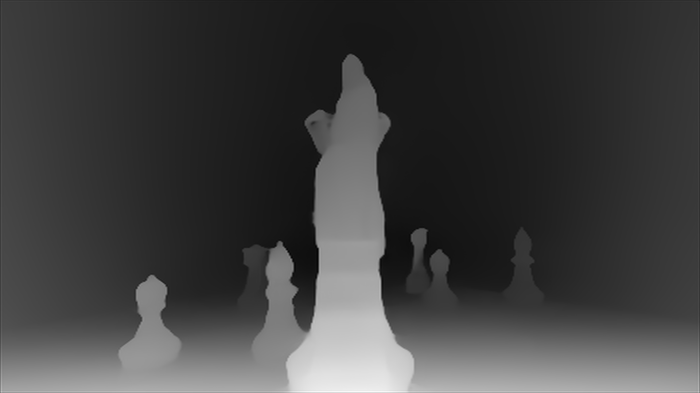 |
| [Depth Anything 3 392](realtime-depth-macos27/captures/DA3_392x392_COREML_CLEAN) | 392 | Core ML image | 23 s / 24 | 15 / 16 / 18 ms | 16 / 17 / 19 ms | 60 fps |  |
| [Depth Anything 3 392](realtime-depth-macos27/captures/DA3_392x392_MPSGRAPH_FP32_CLEAN) | 392 | MPSGraph FP32 | 33 s / 33 | 15 / 16 / 16 ms | 16 / 16 / 18 ms | 60 fps |  |
| [Depth Anything 3 518](realtime-depth-macos27/captures/DA3_518x518_COREML_CLEAN) | 518 | Core ML image | 32 s / 32 | 45 / 54 / 58 ms | 49 / 55 / 61 ms | 60 fps |  |
| [Depth Anything 3 518](realtime-depth-macos27/captures/DA3_518x518_MPSGRAPH_FP32_CLEAN) | 518 | MPSGraph FP32 | 34 s / 35 | 49 / 50 / 50 ms | 50 / 53 / 54 ms | 60 fps | 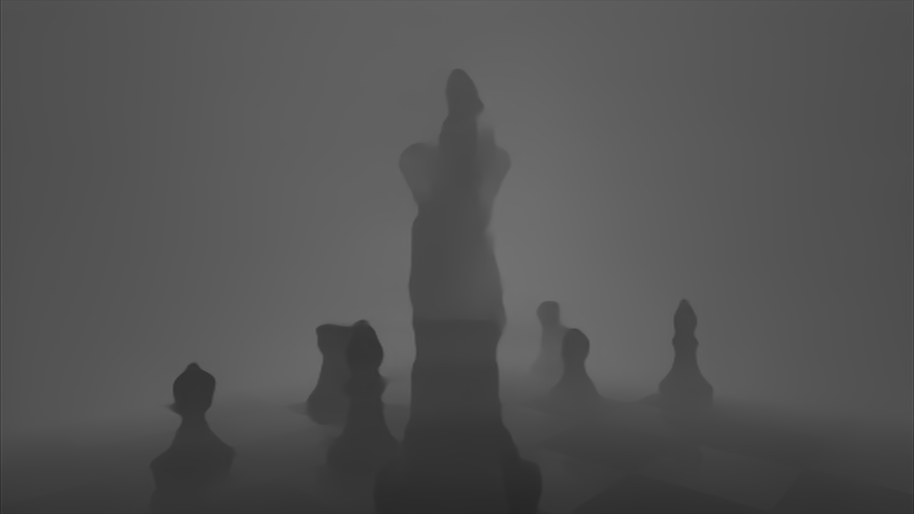 |
| [ZipDepth 384](realtime-depth-macos27/captures/ZIP_384x384_COREML_CLEAN) | 384 | Core ML image | 34 s / 34 | 7 / 8 / 8 ms | 8 / 9 / 11 ms | 60 fps |  |
| [ZipDepth 384](realtime-depth-macos27/captures/ZIP_384x384_MPSGRAPH_FP32_CLEAN) | 384 | MPSGraph FP32 | 33 s / 34 | 6 / 6 / 6 ms | 6 / 6 / 7 ms | 60 fps |  |
| [ZipDepth 384](realtime-depth-macos27/captures/ZIP_384x384_MPSGRAPH_FP16_CLEAN) | 384 | MPSGraph FP16 | 34 s / 34 | 6 / 7 / 7 ms | 6 / 7 / 7 ms | 60 fps | 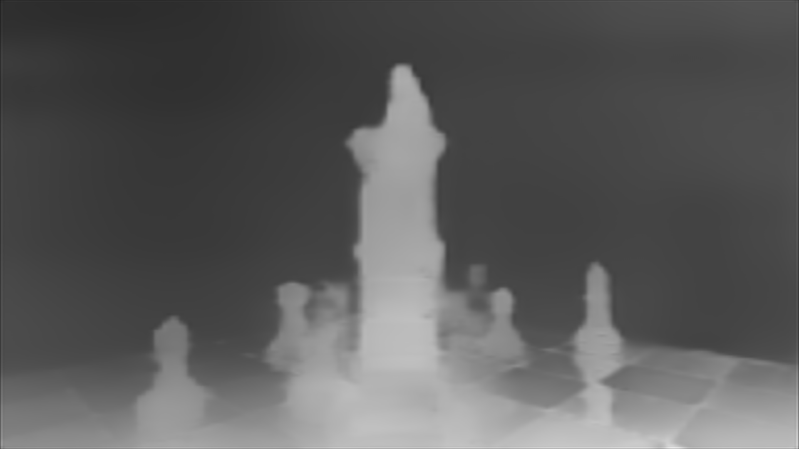 |
| [ZipDepth 512](realtime-depth-macos27/captures/ZIP_512x512_COREML_CLEAN) | 512 | Core ML image | 34 s / 34 | 10 / 10 / 11 ms | 11 / 12 / 13 ms | 60 fps |  |
| [ZipDepth 512](realtime-depth-macos27/captures/ZIP_512x512_MPSGRAPH_FP32_CLEAN) | 512 | MPSGraph FP32 | 34 s / 35 | 8 / 8 / 9 ms | 8 / 8 / 9 ms | 60 fps | 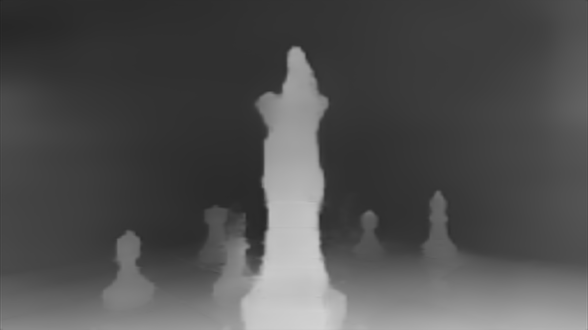 |
| [ZipDepth 672](realtime-depth-macos27/captures/ZIP_672x384_COREML_CLEAN) | 672 | Core ML image | 33 s / 33 | 10 / 10 / 11 ms | 11 / 12 / 12 ms | 60 fps |  |
| [ZipDepth 672](realtime-depth-macos27/captures/ZIP_672x384_MPSGRAPH_FP32_CLEAN) | 672 | MPSGraph FP32 | 34 s / 35 | 8 / 9 / 9 ms | 8 / 9 / 9 ms | 60 fps |  |
| [ZipDepth 896](realtime-depth-macos27/captures/ZIP_896x512_COREML_CLEAN) | 896 | Core ML image | 34 s / 35 | 10 / 10 / 11 ms | 11 / 12 / 12 ms | 60 fps |  |
| [ZipDepth 896](realtime-depth-macos27/captures/ZIP_896x512_MPSGRAPH_FP32_CLEAN) | 896 | MPSGraph FP32 | 32 s / 32 | 12 / 13 / 13 ms | 13 / 13 / 17 ms | 60 fps |  |
| [ZipDepth 896](realtime-depth-macos27/captures/ZIP_896x512_MPSGRAPH_FP16_CLEAN) | 896 | MPSGraph FP16 | 33 s / 33 | 12 / 13 / 13 ms | 12 / 13 / 13 ms | 60 fps |  |
| [ZipDepth 1536](realtime-depth-macos27/captures/ZIP_1536x864_COREML_CLEAN) | 1536 | Core ML image | 35 s / 35 | 34 / 35 / 35 ms | 36 / 36 / 37 ms | 60 fps | 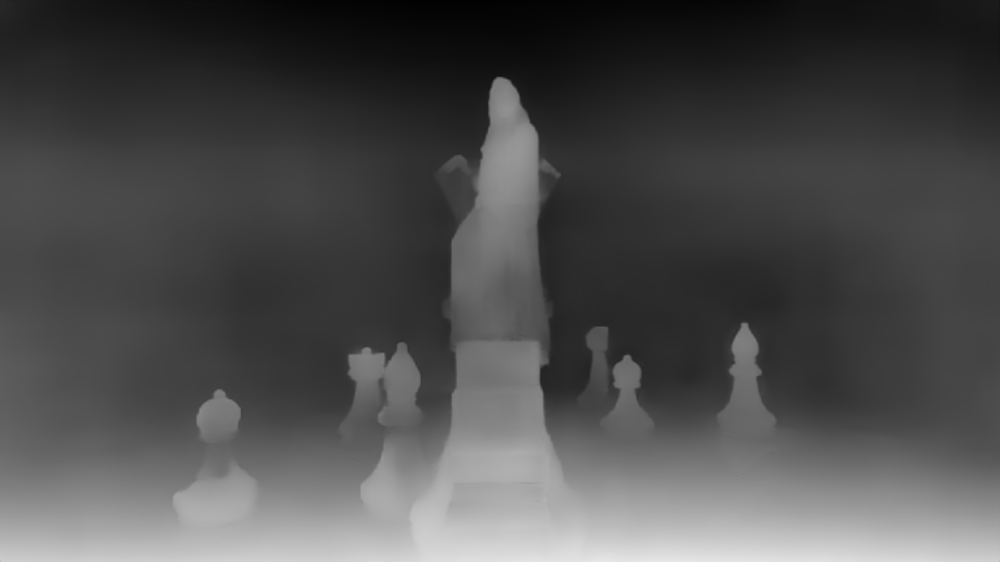 |
| [ZipDepth 1536](realtime-depth-macos27/captures/ZIP_1536x864_MPSGRAPH_FP32_CLEAN) | 1536 | MPSGraph FP32 | 35 s / 35 | 15 / 20 / 23 ms | 15 / 21 / 25 ms | 60 fps | 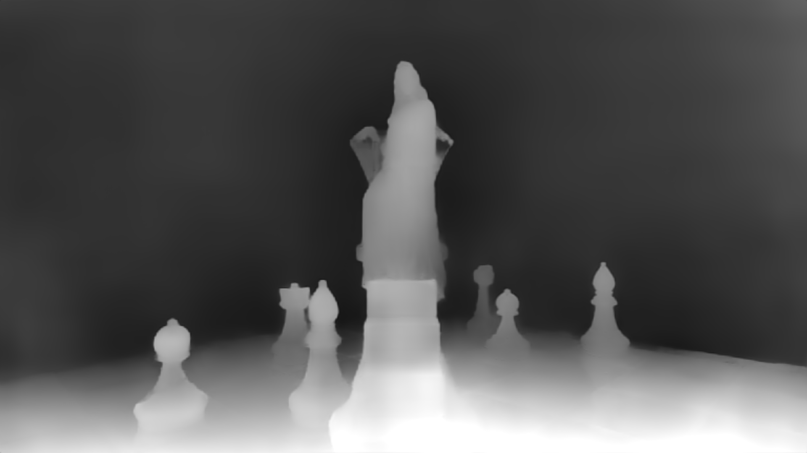 |
| [ZipDepth 1536](realtime-depth-macos27/captures/ZIP_1536x864_MPSGRAPH_FP16_CLEAN) | 1536 | MPSGraph FP16 | 34 s / 34 | 15 / 15 / 17 ms | 15 / 16 / 17 ms | 60 fps |  |
| [ZipDepth 1920](realtime-depth-macos27/captures/ZIP_1920x1088_COREML_CLEAN) | 1920 | Core ML image | 34 s / 34 | 61 / 61 / 61 ms | 62 / 62 / 62 ms | 60 fps |  |
| [ZipDepth 1920](realtime-depth-macos27/captures/ZIP_1920x1088_MPSGRAPH_FP32_CLEAN) | 1920 | MPSGraph FP32 | 33 s / 34 | 43 / 46 / 56 ms | 44 / 47 / 53 ms | 60 fps | 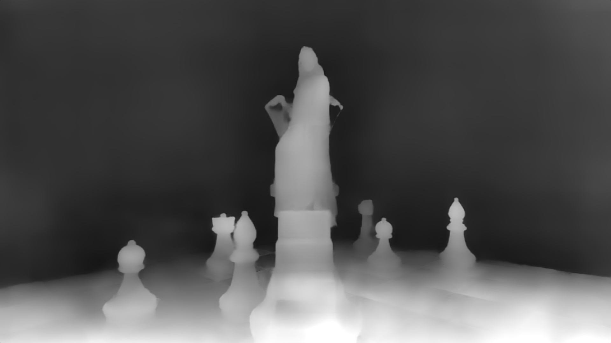 |
| [ZipDepth 1920](realtime-depth-macos27/captures/ZIP_1920x1088_MPSGRAPH_FP16_CLEAN) | 1920 | MPSGraph FP16 | 34 s / 34 | 44 / 46 / 48 ms | 45 / 46 / 47 ms | 59 fps | 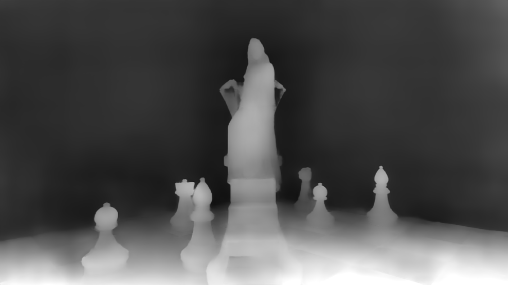 |

## Appendix B: all combined-workload results

These 11 runs used MPSGraph with face and foreground processing active. Eight
record the exact model settings; the three older runs only have user-assigned
model names. Time columns show **typical / p90 / p99** readings. The final
column gives foreground-model and face times separately. Every run finished
normally without lost log events.

| Model | Input width | Input type | Duration / readings | Model time | Full depth time | Display rate | Foreground / face time |
| --- | ---: | --- | ---: | ---: | ---: | ---: | ---: |
| [Depth Anything V2 (older run)](realtime-depth-macos27/captures/DA2_MPS)† | Not recorded | Not recorded | 30 s / 30 | 17 / 20 / 55 ms | 17 / 21 / 56 ms | 60 fps | 20 / 22 ms |
| [Depth Anything V2 448 FP32](realtime-depth-macos27/captures/DA2_448x336_MPSGRAPH_FP32_LOADED) | 448 | FP32 | 35 s / 36 | 29 / 31 / 32 ms | 30 / 32 / 33 ms | 58 fps | 18 / 35 ms |
| [Depth Anything V2 448 FP16](realtime-depth-macos27/captures/DA2_448x336_MPSGRAPH_FP16_LOADED) | 448 | FP16 | 35 s / 35 | 29 / 31 / 33 ms | 30 / 32 / 34 ms | 58 fps | 18 / 35 ms |
| [Depth Anything 3 (older run)](realtime-depth-macos27/captures/DA3_SM_MPS)† | Not recorded | Not recorded | 15 s / 16 | 34 / 39 / 42 ms | 32 / 39 / 42 ms | 57 fps | 18 / 39 ms |
| [ZipDepth (older run)](realtime-depth-macos27/captures/ZIP_MPS)† | Not recorded | Not recorded | 14 s / 14 | 5 / 5 / 5 ms | 5 / 5 / 6 ms | 60 fps | 18 / 9 ms |
| [ZipDepth 512 FP32](realtime-depth-macos27/captures/ZIP_512x512_MPSGRAPH_FP32_LOADED) | 512 | FP32 | 34 s / 35 | 6 / 7 / 8 ms | 7 / 8 / 9 ms | 60 fps | 22 / 11 ms |
| [ZipDepth 672 FP32](realtime-depth-macos27/captures/ZIP_672x384_MPSGRAPH_FP32_LOADED) | 672 | FP32 | 38 s / 38 | 6 / 8 / 8 ms | 6 / 8 / 8 ms | 60 fps | 18 / 11 ms |
| [ZipDepth 896 FP32](realtime-depth-macos27/captures/ZIP_896x512_MPSGRAPH_FP32_LOADED) | 896 | FP32 | 35 s / 36 | 9 / 9 / 9 ms | 9 / 9 / 9 ms | 60 fps | 18 / 12 ms |
| [ZipDepth 896 FP16](realtime-depth-macos27/captures/ZIP_896x512_MPSGRAPH_FP16_LOADED) | 896 | FP16 | 38 s / 38 | 8 / 9 / 12 ms | 8 / 10 / 13 ms | 60 fps | 19 / 12 ms |
| [ZipDepth 1536 FP32](realtime-depth-macos27/captures/ZIP_1536x864_MPSGRAPH_FP32_LOADED) | 1536 | FP32 | 36 s / 36 | 27 / 31 / 32 ms | 29 / 32 / 32 ms | 51 fps | 19 / 40 ms |
| [ZipDepth 1536 FP16](realtime-depth-macos27/captures/ZIP_1536x864_MPSGRAPH_FP16_LOADED) | 1536 | FP16 | 42 s / 42 | 26 / 31 / 32 ms | 28 / 32 / 32 ms | 51 fps | 18 / 39 ms |

† The three older runs date to 2026-09-25, before `capture.configuration` was
added. Their input sizes and types cannot be recovered. Depth Anything 3 saw
zero to four faces per reading, Depth Anything V2 zero to two, and ZipDepth
one to two. Both Depth Anything runs logged one source-frame decode failure.
These different live workloads cannot establish a controlled model ranking.

The eight 2026-09-28 runs record depth settings and MPSMediaPipe face
processing. Face count ranged from zero to four except for the Depth Anything
V2 16-bit run, which recorded one to four. Source segment, complete effect and
analysis settings, matching images, memory use, and full computer/app versions
were not recorded. Losing no log events does not establish whether the app
replaced or discarded any depth requests.

## Appendix C: model-only tests

### Paired model changes

Each row combines three trials with alternating order. Each value is the
middle of the three trial summaries. The MPSGraph test waits for GPU work to
finish, uses `.level0`, and excludes resizing, preparing input, reading depth
output, and fitting that output back to the source image. The tests use 20
warm-up calls; first MPSGraph trials have 200 measured calls and later trials
have 100. Core ML rows include their documented Python image or number-array
handling. Compare original and changed versions within a row. Times show
**typical / p90 / p99** readings.

| Experiment | Method | Input width | Original time | Changed version time | Result |
| --- | --- | ---: | ---: | ---: | --- |
| [Depth Anything V2 448: original vs built-in attention (SDPA)](apple-silicon-depth-optimization/da2-sdpa-findings.md) | Core ML CPU + GPU | 448 | Original 17 / 18 / 19 ms | SDPA 17 / 18 / 19 ms | SDPA slower; rejected |
| [Depth Anything V2 448: original vs built-in attention (SDPA)](apple-silicon-depth-optimization/da2-sdpa-findings.md) | MPSGraph | 448 | Original 12 / 12 / 12 ms | SDPA 12 / 13 / 13 ms | SDPA slower; rejected |
| [Depth Anything V2 448: 32-bit vs 16-bit input](apple-silicon-depth-optimization/da2-fp16-input-findings.md) | MPSGraph | 448 | FP32 12 / 12 / 12 ms | FP16 12 / 12 / 12 ms | Tied |
| [Depth Anything V2 448: image vs number-array input](apple-silicon-depth-optimization/da2-fp16-input-findings.md) | Core ML CPU + GPU | 448 | Image 18 / 20 / 22 ms | Array 21 / 22 / 23 ms | Number-array input slower; test-program overhead differs |
| [ZipDepth 384: 32-bit vs 16-bit input](apple-silicon-depth-optimization/fp16-input-findings.md) | MPSGraph | 384 | FP32 8 / 13 / 19 ms | FP16 6 / 8 / 14 ms | FP16 faster |
| [ZipDepth 896: 32-bit vs 16-bit input](apple-silicon-depth-optimization/fp16-input-findings.md) | MPSGraph | 896 | FP32 6 / 9 / 11 ms | FP16 6 / 9 / 10 ms | Median tied |
| [ZipDepth 1536: 32-bit vs 16-bit input](apple-silicon-depth-optimization/fp16-input-findings.md) | MPSGraph | 1536 | FP32 15 / 18 / 22 ms | FP16 15 / 19 / 23 ms | Tied |
| [ZipDepth 1920: 32-bit vs 16-bit input](apple-silicon-depth-optimization/fp16-input-findings.md) | MPSGraph | 1920 | FP32 22 / 25 / 31 ms | FP16 22 / 26 / 30 ms | Tied |

All changed versions passed their output checks. The experiment reports in
the source index retain each trial and its detailed error measurements.

### Depth Anything 3 hardware choices

The size-392 test kept all three Core ML model instances loaded, changed the
call order each time, and measured 100 predictions after 20 warm-up calls.
It reused one bicubic-resized image. Times include the synchronous Core ML
prediction call and Python/PIL image handling. Values below are the middle
of the three trial summaries. These tests used Python 3.11.15 and Core ML
Tools 9.0 on the M1 Max/macOS 27/Xcode 27 environment.

| Hardware choice | Typical | Slower (p90) | Slowest (p99) | Decision |
| --- | ---: | ---: | ---: | --- |
| CPU + GPU | 24 ms | 27 ms | 30 ms | Retained |
| CPU + Neural Engine | 30 ms | 31 ms | 33 ms | 25% slower; rejected |
| All | 30 ms | 31 ms | 33 ms | 23% slower; rejected |

The [original report](apple-silicon-depth-optimization/da3-compute-unit-findings.md)
records exact model/input checksums, individual trial values, output agreement,
and the repeatable command. Neural Engine and all-device options were slower
in all three trials. Neither a size-518 hardware test nor an additional app
option advanced from this result.

### Earlier model-only reference times

These earlier tests used different programs and conditions. Some original
per-call data is unavailable. They preserve comparisons made at the time,
rather than a common speed ranking across models.

| Model | Input width | Core ML choice and typical time | MPSGraph typical time | Earlier conclusion |
| --- | ---: | --- | ---: | --- |
| ZipDepth 384 | 384 | All 3 ms; CPU + Neural Engine 3 ms; CPU + GPU 13 ms | 3 ms | Led to the ZipDepth hardware and MPSGraph tests |
| Depth Anything V2 448 | 448 | CPU + GPU 15 ms | 15 ms | Similar times |
| Depth Anything V2 448 | 448 | CPU + Neural Engine 23 ms | 16 ms | Keep Core ML on CPU + GPU |
| Depth Anything 3 392 | 392 | CPU + GPU 17 ms | 15 ms | Similar times in this test program |
| Depth Anything 3 518 | 518 | CPU + GPU 24 ms | 40 ms | Core ML faster at the larger shape |

The newer Depth Anything 3 hardware test determines its Core ML hardware
choice. It does not replace the earlier Core ML-versus-MPSGraph comparison,
which used a different procedure and model-loading state.

The older Depth Anything V2 GPU test used eight images with seven alternating
calls per method and image, discarding the first two. Its result is the middle
of the eight image summaries. A broader check across 11 images found exactly
the same Core ML and MPSGraph output.

The older Neural Engine test used one image and 32 alternating calls per
method, discarding the first 12. Output MAE was 4,250 millionths, RMSE 8,730
millionths, and largest difference 185,550 millionths; no invalid numbers were
produced. Both older comparisons excluded image preparation and reading the
output. They ran on the M1 Max with macOS 26.5.2 and Xcode 26.6. The original
program and per-call measurements are unavailable here, so their conclusions
retain those limits.

## Appendix D: expected hardware use

These six Core ML reports were created on the M1 Max/Mac Studio, macOS 27.0
build 26A428, and Xcode 27.0 build 27A266a. Percentages are estimated shares
of work within each hardware choice. They do not measure time, and cannot be
used to compare total work between different models.

| Model | Expected work with all devices allowed | Expected work with CPU + Neural Engine | Work expected outside Neural Engine |
| --- | --- | --- | --- |
| ZipDepth 384 | 96% Neural Engine, 4% CPU | 96% Neural Engine, 4% CPU | Input scaling and conversion to 16-bit |
| ZipDepth 896 | 96% Neural Engine, 4% CPU | 96% Neural Engine, 4% CPU | Input scaling and conversion to 16-bit |
| ZipDepth 1536 | 90% Neural Engine, 10% GPU | 96% Neural Engine, 4% CPU | Input scaling and conversion to 16-bit |
| Depth Anything V2 448 | 95% Neural Engine, 5% GPU | 98% Neural Engine, 2% CPU | Initial input preparation and image-patch processing |
| Depth Anything 3 392 | 97% Neural Engine, 3% GPU | 98% Neural Engine, 2% CPU | Initial input preparation, changing array layout, and image-patch processing |
| Depth Anything 3 518 | 94% Neural Engine, 6% GPU | 97% Neural Engine, 3% CPU | Initial input preparation, changing array layout, and image-patch processing |

With CPU plus Neural Engine selected, the plan prefers Neural Engine for all
120 ZipDepth calculation operations after the two input-conversion steps.
For Depth Anything V2, it assigns 352 calculation operations to Neural Engine;
the five CPU-preferred operations prepare the input and process image patches.
Depth Anything 3's built-in attention operation can run on CPU, GPU, or Neural
Engine. With all devices allowed, the plan prefers GPU for the first attention
block and Neural Engine for the remaining eleven.

At ZipDepth 1536, allowing all devices assigns nine operations to GPU.
Selecting CPU plus Neural Engine gives the same estimated proportions as the
smaller sizes. Actual timing tests are still needed to compare those choices.
The large estimated Neural Engine share did not make Depth Anything V2 or 3
faster, and did not justify removing ZipDepth's scene-context components
(StripPooling and GlobalContext).

The public Core ML API does not report each operation's array dimensions or
number type. Its operation names and output names can be matched to the
source MIL lists. Full summaries and adjacent JSON results are available for
[ZipDepth 384](apple-silicon-depth-optimization/compute-plans/zipdepth-384x384.md),
[ZipDepth 896](apple-silicon-depth-optimization/compute-plans/zipdepth-896x512.md),
[ZipDepth 1536](apple-silicon-depth-optimization/compute-plans/zipdepth-1536x864.md),
[Depth Anything V2 448](apple-silicon-depth-optimization/compute-plans/depth-anything-v2-small-448x336.md),
[Depth Anything 3 392](apple-silicon-depth-optimization/compute-plans/depth-anything-3-small-392x392.md),
and [Depth Anything 3 518](apple-silicon-depth-optimization/compute-plans/depth-anything-3-small-518x518.md).

## Appendix E: output checks

These checks compare converted or changed models with their original output.
They do not rank scene-depth accuracy between model families.

For 16-bit input, Core ML checks use gradient, checkerboard, and repeatable
random inputs with CPU plus GPU. MPSGraph checks use a fixed array of input
values. The table gives each Core ML comparison's worst test-pattern value
and the recorded MPSGraph result. Absolute differences are in millionths of
one depth-output unit; normalized RMSE is in parts per million (ppm).

| Model with 16-bit input | Core ML largest difference (millionths) / normalized RMSE (ppm) | MPSGraph largest difference (millionths) / normalized RMSE (ppm) | Output check |
| --- | --- | --- | --- |
| Depth Anything V2 448 | 5,859 / 706 | 5,859 / 601 | Passed: largest difference ≤ 20,000 millionths and normalized RMSE ≤ 2,000 ppm |
| ZipDepth 384 | 290 / 1,662 | 244 / 840 | Passed: largest difference ≤ 500 millionths and normalized RMSE ≤ 2,000 ppm |
| ZipDepth 896 | 397 / 921 | 305 / 767 | Passed: same ZipDepth thresholds |
| ZipDepth 1536 | 259 / 516 | 366 / 681 | Passed: same ZipDepth thresholds |
| ZipDepth 1920 | 305 / 576 | 397 / 682 | Passed: same ZipDepth thresholds |

The Depth Anything V2 attention change produced exactly the same 16-bit output
in the recorded Core ML and MPSGraph comparisons. Before conversion, its
PyTorch largest difference was about 5 millionths and normalized RMSE below
1 ppm. It replaced 24 matrix-multiplication and 12 softmax operations with
twelve built-in attention operations (SDPA). Rebuilding the original Core ML
image-input version also produced identical output on all three test patterns.
Despite preserving output, the attention candidate was slower and was rejected.

The Depth Anything 3 392 hardware test required cosine disagreement of at most
1,000 ppm and MAE of at most 10,000 millionths. Cosine disagreement measures
a difference in the overall pattern of output values; smaller is closer.
CPU plus Neural Engine produced disagreement of 5 ppm, MAE of 9,573
millionths, and largest difference of 63,477 millionths. Allowing all devices
produced disagreement of 1 ppm, MAE of 3,832 millionths, and largest difference
of 24,414 millionths. Both passed, but both were slower than CPU plus GPU.

The older Depth Anything 3 conversion that removed its camera token is
excluded. It also removed part of the model's original attention behavior
and reached only about 93% Pearson correlation with the official output on
the recorded example. The version preserving the camera token remains the
reference model.

For technical reproduction, MPSGraph inputs use NCHW layout, separate RGB
channels, and values from 0 to 255. FP16 or FP32 describes how those input
numbers are stored. Scaling and model normalization remain in the converted
model; output is FP16 at the input dimensions. The model manifest records the
exact settings. Depth Anything V2 keeps its simplified depth-output processing.
ZipDepth keeps its combined calculation steps and simpler image-enlargement
method. Depth Anything 3 keeps its camera token and original attention behavior.
These starting changes have not each had a separate speed test.

## Glossary

| Term | Meaning in this study |
| --- | --- |
| 1080p | An image 1920 pixels wide and 1080 pixels high. The “p” means progressive scanning. |
| Core ML | Apple's framework for running models on supported hardware. ML means machine learning. |
| MPSGraph | Metal Performance Shaders Graph, Apple's framework used here to run converted models on the GPU. |
| CPU | Central processing unit: the computer's general-purpose processor. |
| GPU | Graphics processing unit: the processor used for graphics and many parallel calculations. |
| Neural Engine / ANE | Apple's Neural Engine, a processor designed for machine-learning work. ANE means Apple Neural Engine. |
| NPU | Neural processing unit. “Base NPU” is part of the tested ZipDepth model's name. |
| FP16 / FP32 | Floating-point numbers stored in 16 or 32 bits. Here the labels identify the MPSGraph input type; both versions already use 16-bit model calculations and output. |
| DA2 / DA3 | File/report abbreviations for Depth Anything V2 Small and Depth Anything 3 Small. |
| V2 | Version 2, as used in the name Depth Anything V2. |
| M1 Max | The Apple processor in the Mac Studio used for these tests. |
| RGB | Red, green, and blue: the three image color channels. |
| NCHW | Array order: N is batch size, C is color channels, H is height, and W is width. |
| fps | Frames per second. Here it describes the displayed frame rate unless otherwise stated. |
| ms / s | Milliseconds / seconds. One millisecond is one thousandth of a second. |
| Median / typical time | The middle reading: half the readings are at or below it. |
| p90 / p99 | The 90th / 99th percentile: 90% / 99% of recorded readings are at or below that value. |
| ppm | Parts per million: a way to show very small differences using whole numbers. |
| MAE | Mean absolute error: the average size of a difference between matching output values. |
| RMSE | Root mean square error: a difference score that gives larger errors more weight. “Normalized” means divided by the reference output scale used by the test. |
| IoU | Intersection over union: an overlap score between a predicted foreground mask and a reference mask. |
| SDPA | Scaled dot-product attention: a calculation used by the model to weigh related image information. |
| API | Application programming interface: the public methods a program uses to request information or work from a framework. |
| JSON | JavaScript Object Notation: the structured text format used for saved results and model details. |
| MIL | Model Intermediate Language: Core ML Tools' internal description of model operations. |
| PIL | Python Imaging Library; the tests use its image interface through Pillow. |
| MIT license | A permissive software license named for the Massachusetts Institute of Technology. |
| iOS | Apple's operating system for iPhone. Its version labels also identify Core ML model formats that macOS supports. |
| CLEAN / LOADED | Labels in saved filenames: CLEAN means depth-only; LOADED means faces and foreground processing are also active. |
| MESS | The application used to combine depth, face detection, foreground extraction, and image effects in these tests. |
| MPSMediaPipe | The face-processing implementation named in the saved logs; “MPS” refers to Metal Performance Shaders. |
| Camera token | A learned extra input in Depth Anything 3. The retained conversion keeps it and the model's original attention behavior. |
| Tensor / planar input | A numeric array; “planar” means each color channel is stored separately. |
| Softmax | A calculation that turns a set of model scores into weights that add up to one. |
| Checksum | A file fingerprint used to check that the expected file or version is being used. |
| README | The repository's introductory document; its name means “read me.” |
| Input buffer | Temporary memory holding the image values that the model will read. |
| Foreground mask | An image marking which pixels belong to the foreground subject. |
| Pearson correlation | A score for how two sets of output values vary together; it does not measure whether depth is accurate in the real scene. |
| Normalization | Adjusting values to the scale or distribution expected by a model step. |
