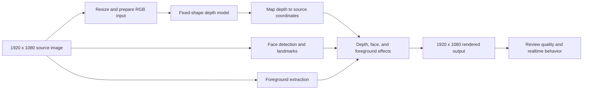

# From a 1080p image to depth in a realtime application

**Updated:** 2026-09-28 · **Application:** MESS

**Measured platform:** Apple M1 Max, macOS 27.0, Xcode 27.0

The study asks: **given a 1920 x 1080 image, which depth model, input size,
runtime, and optimization should an application use when depth, face detection,
and foreground extraction all contribute to the final image?**

This document consolidates the existing measurements, conversion experiments,
visual references, deployment constraints, and next steps. All original reports
remain available in the [source index](#source-index). The latest controlled
application results take precedence over earlier isolated results and older
reports that still describe the CLEAN comparisons as pending.

Measurements are rounded to whole numbers for readability. Percent changes
and route selections use the original values, so rounded times can look tied.
Exact measurements remain in the raw captures and source reports.

The current evidence supports a performance shortlist:

- **Lowest depth cost:** ZipDepth 384 x 384, MPSGraph FP32, at **6 ms**
  median complete depth-source latency in the CLEAN application run.
- **General 1080p candidates:** ZipDepth 672 x 384 with MPSGraph FP32 and
  ZipDepth 896 x 512. Core ML wins the CLEAN 896 comparison; the loaded graph
  observations make MPSGraph worth a controlled comparison under contention.
- **High-resolution candidate:** ZipDepth 1536 x 864 with MPSGraph FP16, at
  **15 ms** CLEAN median with substantially better tails than FP32. Its
  initial loaded capture presented at **51 fps**, so it needs a separate
  decision for the combined workload.
- **Alternative model families:** DA2 448 x 336 and DA3 392 x 392 remain
  useful visual-quality controls, with CLEAN graph medians around **15–16 ms**.

These are measured performance choices and proposed evaluation sizes.
**A quality winner for the combined application has not yet been established.**
Conversion checks measure numerical agreement, rendered examples show useful
effects, and loaded captures expose contention. Matched raw-depth, face,
foreground, and temporal-quality scores are still needed to select a final
application default.

## Reading guide

1. [The 1080p workflow](#the-1080p-workflow)
2. [Candidates used](#candidates-used)
3. [Optimizations applied and evaluated](#optimizations-applied-and-evaluated)
4. [How performance was measured](#how-performance-was-measured)
5. [Results and top performers](#results-and-top-performers)
6. [Quality evidence and the combined application](#quality-evidence-and-the-combined-application)
7. [Recommended sizes and routes](#recommended-sizes-and-routes)
8. [Remaining work](#remaining-work)
9. [Deployment and reproduction](#deployment-and-reproduction)
10. [Suggested documentation organization](#suggested-documentation-organization)

The appendices retain the complete realtime matrix, loaded observations,
standalone comparisons, and compute-plan estimates so the narrative can be
read without losing the detailed results.

Jump to [all CLEAN results](#appendix-a-complete-clean-application-matrix),
[all loaded observations](#appendix-b-complete-loaded-application-observations),
[standalone comparisons](#appendix-c-standalone-timing-comparisons), or
[placement estimates](#appendix-d-core-ml-placement-context).

## The 1080p workflow

1080p describes the source and final presentation. It does **not** require
running the depth model at 1920 x 1080. The application prepares a smaller,
fixed-size input, infers depth, and maps the result back into the source image's
coordinates for effects and compositing.



This is the intended evaluation workflow. The repository contains depth
conversion recipes and MESS measurements; the application implementation lives
in MESS. Existing captures validate 1920 x 1080 **rendered snapshots** and the
exact depth tensor dimensions. They do not independently record the original
source resolution or every resize/crop/pad transform. A fully reproducible
1080p-input claim therefore also needs source dimensions and geometry recorded
with the next batch.

The depth path has three important stages:

1. **Prepare the input.** Resize the RGB image to the model's fixed dimensions.
   Core ML's existing application route uses image input. MPSGraph uses planar
   RGB in NCHW layout, with FP32 or FP16 values in the 0...255 range. Pixel
   scaling and normalization follow the exported model contract.
2. **Infer depth.** Run the fixed-shape package through Core ML or MPSGraph.
   The released graph contracts produce FP16 depth at the model dimensions.
3. **Use depth at 1080p.** Map the depth result into the rendered image and
   combine it with the face and foreground results. Consistent orientation,
   crop/padding, timestamps, and coordinates belong in the quality review.

Record the actual image transform when comparing square, 4:3, and wide models.
Model dimensions alone do not establish whether the application stretches,
crops, or pads a 16:9 source. A larger tensor also does not establish better
depth quality without matched output review.

ZipDepth dimensions must be multiples of 32. The application's `ZIP 1080`
option therefore uses **1920 x 1088**, rather than a literal 1920 x 1080 tensor.
1536 x 864 is an exact 16:9 alternative with 37% fewer model pixels.
The eight extra rows at 1088 are a small part of the cost; the larger activation
and compute workload is the main resolution tradeoff.

## Candidates used

All shapes below are width x height. Sizes within a family use the same pinned
checkpoint; they are fixed-shape exports rather than separately trained models.
The measured CLEAN matrix covers 14 MPSGraph variants and nine Core ML controls.

| Family | Fixed inputs evaluated | Core ML application input | MPSGraph inputs evaluated | Implementation retained |
| --- | --- | --- | --- | --- |
| Depth Anything V2 Small (DA2) | 448 x 336 | RGB image | FP32 and FP16 | Fixed-shape realtime export, optimized depth head, classic decomposed attention |
| Depth Anything 3 Small (DA3) | 392 x 392; 518 x 518 | RGB image | FP32 | Learned camera token, alternating attention, twelve native scaled-dot-product-attention operations |
| ZipDepth Base NPU | 384 x 384; 512 x 512; 672 x 384; 896 x 512; 1536 x 864; 1920 x 1088 | RGB image | FP32 at all six sizes; FP16 at 384, 896, 1536, and 1920 | Balanced global context, fused convolution/batch normalization, unfold-free upsampling |

The size sweep covers different budgets and geometries:

| Family / shape | Model pixels | Share of 1920 x 1080 pixels | Geometry |
| --- | ---: | ---: | --- |
| DA2 448 x 336 | 150,528 | 7% | 4:3 |
| DA3 392 x 392 | 153,664 | 7% | Square |
| DA3 518 x 518 | 268,324 | 13% | Square |
| ZipDepth 384 x 384 | 147,456 | 7% | Square |
| ZipDepth 512 x 512 | 262,144 | 13% | Square |
| ZipDepth 672 x 384 | 258,048 | 12% | Near 16:9, rounded to multiples of 32 |
| ZipDepth 896 x 512 | 458,752 | 22% | Near 16:9, rounded to multiples of 32 |
| ZipDepth 1536 x 864 | 1,327,104 | 64% | Exact 16:9 |
| ZipDepth 1920 x 1088 | 2,088,960 | 101% | Full-width 1080-class tensor |

512 x 512 and 672 x 384 have nearly equal pixel counts, making them useful
geometry controls. Neither currently has an FP16-input graph variant.

DA2 and DA3 Core ML use CPU plus GPU in MESS. ZipDepth Core ML retains an
application policy that can choose CPU plus Neural Engine when depth is
prioritized and CPU plus GPU when competing foreground/person analysis changes
that priority. Its application captures measure that policy; they do not
establish fixed accelerator placement.

Exact tensor contracts, output scales, archive hashes, source revisions, and
licenses are recorded in the [artifact manifest](../manifests/mpsgraph-depth-models-macos27-v0.1.0.json)
and [third-party notices](../THIRD_PARTY_NOTICES.md). The manifest also records
family-specific MESS output scales. Raw values across these families should
not be treated as a shared calibrated distance scale.

## Optimizations applied and evaluated

The existing exports already use fixed shapes and FP16 model computation.
DA2 has its fixed realtime source patch and optimized depth head. ZipDepth
fuses convolution/batch normalization and uses its NPU unfold-free upsampling
path. DA3's conversion preserves the camera token and attention behavior.
These are baseline implementation choices; the study has not isolated a
separate speedup for every one of them.

The follow-up experiments changed one factor at a time:

| Change | What it tests | Measured outcome | Current disposition |
| --- | --- | --- | --- |
| Core ML versus MPSGraph | Application integration and runtime choice at the same fixed shape | MPSGraph wins most CLEAN comparisons; Core ML wins ZipDepth 896 and the DA3 518 median | Select per shape and workload |
| Fixed input-size sweep | Compute cost and available spatial detail | ZipDepth spans 6 to 44 ms for each shape's best CLEAN graph route | Retain a small evaluation shortlist; confirm quality separately |
| Planar FP16 graph input | Direct FP16 Metal packing, half the input-buffer bytes, removal of the leading cast | Benefit varies by family and shape | Prefer FP16 for ZipDepth 896 graphs and 1536 graphs; retain FP32 for DA2, ZipDepth 384, and ZipDepth 1920 |
| DA2 native scaled dot-product attention (SDPA) | Replace 24 matmul and 12 softmax operations with twelve native attention operations | Numerical gates passed; Core ML was 2–3% slower and MPSGraph 4–5% slower in paired trials | Rejected before app integration; retain classic attention |
| DA3 Core ML compute units | CPU + GPU versus CPU + Neural Engine versus all | At 392, CPU + Neural Engine and all were 25% and 23% slower by aggregate median | Keep CPU + GPU; larger-shape compute-unit sweep did not advance |
| Core ML compute-plan audit | Test presumed CPU fallback before rewriting a network | High estimated Neural Engine placement in all audited families | Placement is context; measured runtime decides |
| ZipDepth global-context ablations | Remove StripPooling and/or GlobalContext | Audit did not identify the presumed fallback boundary | Deferred; no quality or speed result exists for these variants |

FP16 **input** is independent of the model's already-FP16 computation and
output. It halves the planar input buffer, not the whole application working
set. Packing, memory use, and individual preprocessing stages have not been
measured separately in the checked-in realtime captures.

| FP16-input candidate | FP32 input bytes | FP16 input bytes | CLEAN complete-depth median: FP32 → FP16 | Application interpretation |
| --- | ---: | ---: | --- | --- |
| DA2 448 x 336 | 1,806,336 | 903,168 | 15 → 15 ms | Tied; keep FP32 |
| ZipDepth 384 x 384 | 1,769,472 | 884,736 | 6 → 6 ms | FP16 10% slower; keep FP32 |
| ZipDepth 896 x 512 | 5,505,024 | 2,752,512 | 13 → 12 ms | FP16 9% faster within MPSGraph; Core ML still wins CLEAN at 11 ms |
| ZipDepth 1536 x 864 | 15,925,248 | 7,962,624 | 15 → 15 ms | Median close; p90 improves 21 → 16 ms and p99 25 → 17 ms |
| ZipDepth 1920 x 1088 | 25,067,520 | 12,533,760 | 44 → 45 ms | Median close; keep FP32 based on median and presentation |

The 384 FP16 isolated graph trials initially showed a 28–36% median
reduction. The controlled application comparison reversed that result.
At 896, 1536, and 1920, isolated graph execution was effectively tied, while
some complete application paths benefited. This is why the full depth path is
the primary performance measure.

The 896 graph comparison also differs in serialization target: the CLEAN FP32
graph targets macOS 15, while FP16 targets macOS 27. A separate target-parity
probe produced identical output and similar execution on macOS 27, but the
CLEAN pair should not be described as differing exclusively in input precision.

## How performance was measured

The main application evidence was recorded on 2026-09-28 on an M1 Max running
macOS 27.0 with Xcode 27.0 build 27A266a. Earlier captures date to 2026-09-25.
The compatibility/audit records identify the host as Mac Studio `Mac13,1` and
macOS build 26A428. Individual loaded captures do not embed full host or app
build identities.

| Evidence | Workload and protocol | What it supports |
| --- | --- | --- |
| CLEAN application matrix | Release build; same prerecorded source and segment, output size, 60 fps target, and one identical depth-consuming effect; foreground/person and face work disabled; fresh launch and warm-up; at least 20 seconds captured; one in-capture snapshot | Controlled application comparison of depth routes and sizes |
| Configured LOADED observations | Foreground and face work active; exact depth model, input, shape, MPSGraph backend, MPSMediaPipe face backend, and 60 fps target recorded | Initial contention evidence; source segment, full effect/analysis configuration, host/build identity, matched frames, and memory are missing |
| Standalone paired MPSGraph | Synchronous GPU completion, `.level0`, 20 warmups, alternating order, three trials | Graph execution and conversion agreement; excludes texture resize, Metal packing, depth unpacking, and output upscale |
| Standalone paired Core ML | Documented synchronous prediction protocol; Python/PIL or tensor bridge where applicable | Compare routes within the same experiment; bridge and residency state affect absolute timings |
| Core ML compute plan | Anticipated devices and normalized estimated cost; no predictions | Placement hypotheses, rather than latency or a trace of actual execution |

For MPSGraph, **model time** spans encoding through the completion callback and
can include queued preprocessing dependencies. **Complete depth-source time**
spans the app worker's request start through its completed depth result and
final GPU command-buffer completion. It is the complete depth path, not the
combined face/foreground/render pipeline's end-to-end latency.

The diagnostic stream samples the latest timing values approximately once per
second. Depth metrics are stored as `1000 / operation_ms`; the summarizer
converts each sample back to milliseconds, excludes `elapsed_s < 1`, then
computes median, p90, and p99. Model and complete-depth values are sampled
independently, so their aggregate medians can occasionally appear out of order.

**Presentation fps and depth update cadence are different measurements.**
Presentation is the sampled rolling 60-frame render rate. The stream does not
count delivered depth completions or superseded requests. A 60 fps rendered
output therefore does not prove 60 fresh depth maps per second. The current
p99 values also come from tens of one-second samples, rather than a full
distribution of every completed request.

## Results and top performers

### Controlled depth-only results

All 23 accepted CLEAN captures ended normally with zero dropped diagnostic
events, recorded no foreground or face timing, and linked a valid 1920 x 1080
snapshot. The fastest route below means the lowest **median complete
depth-source latency within a tested family and shape**. Close differences and
tail behavior are included in the interpretation.

| Family / size | Best CLEAN median route | Median | p90 | p99 | Interpretation |
| --- | --- | ---: | ---: | ---: | --- |
| DA2 448 x 336 | MPSGraph FP32 | 15 ms | 16 ms | 16 ms | 8% lower median than Core ML; FP16 tied |
| DA3 392 x 392 | MPSGraph FP32 | 16 ms | 16 ms | 18 ms | 6% lower median than Core ML |
| DA3 518 x 518 | Core ML image | 49 ms | 55 ms | 61 ms | 2% lower median than MPSGraph; graph has better tails |
| ZipDepth 384 x 384 | MPSGraph FP32 | 6 ms | 6 ms | 7 ms | Fastest depth route in the CLEAN matrix |
| ZipDepth 512 x 512 | MPSGraph FP32 | 8 ms | 8 ms | 9 ms | 31% lower median than Core ML |
| ZipDepth 672 x 384 | MPSGraph FP32 | 8 ms | 9 ms | 9 ms | Wide, low-cost candidate; 24% lower median than Core ML |
| ZipDepth 896 x 512 | Core ML image | 11 ms | 12 ms | 12 ms | Core ML wins CLEAN; FP16 is the preferred tested graph input |
| ZipDepth 1536 x 864 | MPSGraph FP16 | 15 ms | 16 ms | 17 ms | 57% lower median than Core ML and tighter tails than FP32 |
| ZipDepth 1920 x 1088 | MPSGraph FP32 | 44 ms | 47 ms | 53 ms | 28% lower median than Core ML; expensive for frequent fresh depth |

DA2's Core ML route is the older-system alternative at 17 / 18 / 21 ms.
At DA3 518, MPSGraph measured 50 / 53 / 54 ms: a slightly higher
median with better tail latency. At ZipDepth 896, MPSGraph FP16 measured
12 / 13 / 13 ms and FP32 measured 13 / 13 / 17 ms.

At a 60 fps target, one presentation interval is about 17 ms. Several
depth-only medians fit within that interval, but concurrent work, scheduling,
tail latency, and depth age still determine the usable combined application
result. The CLEAN matrix alone cannot establish that result.

### Depth, face, and foreground running together

Eight configured loaded captures provide initial combined-workload evidence.
All use MPSGraph for depth and record active foreground and face timing.

| Model / shape | Loaded complete-depth median: FP32 / FP16 | Presentation median: FP32 / FP16 | Observation |
| --- | --- | --- | --- |
| DA2 448 x 336 | 30 / 30 ms | 58 / 58 fps | Input precision tied |
| ZipDepth 512 x 512 | 7 / not tested ms | 60 / not tested fps | Low-cost observation; foreground median 22 ms |
| ZipDepth 672 x 384 | 6 / not tested ms | 60 / not tested fps | Low-cost observation; foreground median 18 ms |
| ZipDepth 896 x 512 | 9 / 8 ms | 60 / 60 fps | FP16 median 6% lower; p90/p99 worse |
| ZipDepth 1536 x 864 | 29 / 28 ms | 51 / 51 fps | FP16 median 4% lower; p90/p99 effectively tied |

Loaded latency sometimes appears lower than CLEAN latency for the same model.
These batches do not freeze or record the same full workload and source, so
that does not establish that adding face and foreground work improves depth
execution. Likewise, 512 and 672 cannot be ranked by their loaded times alone:
their competing foreground workload differed materially.

The 896 FP16 loaded p90 rose from 9 to 10 ms and p99 from 9 to
13 ms. Its median improvement merits a controlled repeat. There is no
configured loaded Core ML 896 control, so the best backend for the combined
896 workload remains unresolved.

The 1536 result makes the application question concrete: a model with an
approximately 15 ms CLEAN path can take approximately 28 ms under the recorded
loaded conditions while presentation falls near 51 fps. The study needs to
judge this alongside quality and delivered depth cadence before adopting it.

The three older loaded captures are retained in Appendix B. Their selected
shapes and input types were not recorded, so they are historical context for
the model families rather than evidence for a recommended size.

## Quality evidence and the combined application

Quality has three distinct meanings in this study:

| Quality question | Existing evidence | Current conclusion |
| --- | --- | --- |
| Does the conversion or optimization preserve its source output? | Deterministic fixtures, paired depth comparisons, error thresholds, and compute-unit output checks | Tested candidates passed their documented numerical gates, including some rejected for speed |
| Does the depth produce a useful rendered effect? | MESS contour examples and 23 CLEAN snapshots at 1920 x 1080 | Useful qualitative references; no scored cross-model quality ranking |
| Does the combined application preserve faces, foreground edges, depth structure, and temporal stability? | Active workload timings in loaded captures | Combined quality is unscored; matched layers and sequences are needed |

Passing a conversion gate is evidence of fidelity to the chosen model, not
accuracy against real-world depth or a ranking between model families.
Foreground and face timing also do not measure extraction or detection quality.
No checked-in benchmark provides ground-truth depth accuracy, foreground IoU,
face detection accuracy, or a temporal stability score for the combined runs.

### Numerical fidelity already checked

The FP16-input Core ML checks used gradient, checker, and seeded-random inputs
through CPU plus GPU. The graph checks used a fixed planar input. The table
reports the worst fixture value for each Core ML comparison and the recorded
graph comparison. Absolute errors are expressed in millionths of a depth
output unit; normalized RMSE is expressed in parts per million (ppm). These
units retain small differences while keeping the displayed values whole.

| Candidate | Core ML maximum absolute error (millionths) / maximum normalized RMSE (ppm) | Graph maximum absolute error (millionths) / normalized RMSE (ppm) | Gate |
| --- | --- | --- | --- |
| DA2 FP16 input 448 x 336 | 5,859 / 706 | 5,859 / 601 | Passed: max error ≤ 20,000 millionths and normalized RMSE ≤ 2,000 ppm |
| ZipDepth FP16 input 384 x 384 | 290 / 1,662 | 244 / 840 | Passed: max error ≤ 500 millionths and normalized RMSE ≤ 2,000 ppm |
| ZipDepth FP16 input 896 x 512 | 397 / 921 | 305 / 767 | Passed: same ZipDepth thresholds |
| ZipDepth FP16 input 1536 x 864 | 259 / 516 | 366 / 681 | Passed: same ZipDepth thresholds |
| ZipDepth FP16 input 1920 x 1088 | 305 / 576 | 397 / 682 | Passed: same ZipDepth thresholds |

DA2 native SDPA preserved exact FP16 output in the recorded Core ML and graph
comparisons. Its pre-conversion PyTorch maximum error was about 5 millionths
and normalized RMSE was below 1 ppm. The rebuilt DA2 image-input control also
produced exact output on all three fixtures.

DA3's 392 compute-unit experiment passed a cosine disagreement ≤ 1,000 ppm
and mean absolute error ≤ 10,000 millionths gate. Cosine disagreement is one
minus cosine similarity. Relative to CPU plus GPU, CPU plus Neural Engine
produced disagreement of 5 ppm, MAE of 9,573 millionths, and maximum error of
63,477 millionths; `all` produced disagreement of 1 ppm, MAE of 3,832
millionths, and maximum error of 24,414 millionths.

The old camera-token-disabled DA3 conversion is excluded: it removed learned
camera-token and alternating global-attention behavior and reached only about
93% Pearson correlation with the official path on the recorded sample. The
camera-token-preserving package is the retained baseline.

### Rendered references

These snapshots come from the controlled CLEAN runs and show the same
depth-consuming treatment. They support visual inspection of the selected
routes. They are rendered effects, rather than raw-depth maps or completed
face/foreground/depth comparisons. All 23 snapshots are embedded in Appendix A;
the original free-form examples remain in the README and source reports.

| Route | Controlled 1920 x 1080 rendered reference |
| --- | --- |
| ZipDepth 384 x 384, MPSGraph FP32 |  |
| ZipDepth 672 x 384, MPSGraph FP32 |  |
| ZipDepth 896 x 512, Core ML |  |
| ZipDepth 1536 x 864, MPSGraph FP16 |  |
| DA2 448 x 336, MPSGraph FP32 |  |
| DA3 392 x 392, MPSGraph FP32 |  |

### Proposed quality review for the next batch

Use the same 1080p source frames and fixed rendered settings for each finalist.
Include close faces, multiple people, hair and hands, thin edges, occlusion,
low contrast, and motion. Save the source frame, raw depth visualization,
foreground mask, face boxes/landmarks, final composite, and a short matched
sequence. Normalize raw-depth displays consistently and document any
model-specific output scaling or effect calibration.

| Review dimension | What to examine | How to record it |
| --- | --- | --- |
| Scene depth structure | Foreground/background ordering, faces and bodies, separation of overlapping objects | Annotated matched depth maps; if reference depth exists, add a declared accuracy metric and alignment policy |
| Foreground edges | Hair, hands, thin structures, mask holes, halos, and disagreement between mask and depth | Matched crops; mask IoU/boundary measures only where reference masks exist |
| Faces | Missed faces, box/landmark alignment, and depth behavior around face effects | Face count and annotated overlays on the same frames; compare with reference annotations where available |
| Temporal stability | Depth flicker, mask chatter, face jitter, and lag between layers | Matched sequences, layer timestamps, visible regression notes, and depth age once instrumented |
| Final rendered effect | Contour readability, subject separation, edge bleed, and consistency at 1080p | Review final composites at full resolution with the same preset |

For an initial visual pass, record each dimension as **pass**, **minor issue**,
or **fail**, with a frame/time reference and a short reason. This is a proposed
rubric; no scores have been assigned. Keep performance measurements alongside
quality notes so the selected size earns its extra cost in the actual effect.

## Recommended sizes and routes

These recommendations select a manageable evaluation set from the recorded
results. They do not change a MESS default or claim unmeasured visual superiority.

| Application need | Recommended candidate | Why it advances | What remains before final selection |
| --- | --- | --- | --- |
| Minimum depth cost | ZipDepth 384 x 384, MPSGraph FP32 | Lowest CLEAN median, 6 ms; FP16 regressed | Confirm that the smaller square tensor preserves the required subject and edge detail; no configured loaded 384 result |
| Low-cost wide input for 1080p | ZipDepth 672 x 384, MPSGraph FP32 | 8 ms CLEAN median; initial loaded presentation near 60 fps | Matched quality review and controlled loaded comparison |
| More model pixels while retaining a modest CLEAN budget | ZipDepth 896 x 512, Core ML as the CLEAN baseline; MPSGraph FP16 as the loaded challenger | Core ML wins CLEAN at 11 ms; FP16 is the better tested graph route and held 60 fps in an initial loaded run | Controlled Core ML versus graph comparison with identical face/foreground workload; repeat graph tails |
| Higher-resolution depth for effects that justify it | ZipDepth 1536 x 864, MPSGraph FP16 | Exact 16:9; 15 ms CLEAN median with better tails than FP32 | Demonstrate added visual value and acceptable loaded behavior; initial loaded presentation is near 51 fps |
| Full-width 1080-class experiment | ZipDepth 1920 x 1088, MPSGraph FP32 | Best median at this shape, 44 ms | Retain as an optional resolution reference; no measured quality advantage justifies the cost as a general default |
| Alternative model behavior | DA2 448 x 336, MPSGraph FP32; DA3 392 x 392, MPSGraph FP32 | Smallest tested variants of these families, around 15–16 ms CLEAN | Compare visual behavior against ZipDepth on the same scenes; configured DA3 loaded result is missing |
| Older macOS app target | Existing image-input Core ML routes | All released source packages support a macOS 15 app target | Validate on the oldest claimed runtime; current timing evidence comes from macOS 27 |

Start the general 1080p evaluation with **672 x 384 and 896 x 512**. Keep
384 x 384 as the speed control and 1536 x 864 as the high-resolution challenger.
512 x 512 remains useful if square input fits the actual transform or its
matched output is preferable; the recorded timing does not establish a quality
benefit over 672 x 384. Include DA2 and DA3 392 when comparing model behavior,
rather than expanding every runtime/precision combination again.

DA3 518 and ZipDepth 1920 are optional high-cost controls. Their CLEAN medians
exceed a 17 ms interval by a large margin even when presentation stays near
60 fps. That cost needs a demonstrated visual benefit or an application policy
that accepts less frequent depth updates.

## Remaining work

The CLEAN matrix is complete. The next useful milestone is a **controlled
combined application comparison with matched quality evidence**.

1. **Freeze the batch.** Record the M1 Max/other host, macOS and Xcode builds,
   MESS and bundle commits, model checksums, original source resolution,
   prerecorded segment, transforms, output size, target fps, effect preset,
   foreground/person settings, face backend, and warm-up policy. The existing
   checklist specifies MESS commit `b4628f1243` and bundle commit `095b1d5`, or
   a later revision retaining the capture metadata and lower-target 896 graph.
2. **Measure finalists under the same load.** Compare the 672 graph candidate,
   896 Core ML and FP16 graph routes, and 1536 FP16 with its FP32 control.
   Add 384, DA2 FP32, or DA3 392 if the matched visual review makes them finalists.
   Relaunch for every route, stabilize, capture at least 20 seconds using the
   current contract, and repeat close or surprising pairs in reverse order.
3. **Save the quality layers and sequence.** Use the proposed rubric, retain
   one in-capture rendered snapshot, and record a visual-regression decision.
   The existing loaded captures lack matched visual references and complete
   source/effect identity, so they do not complete this milestone.
4. **Collect the missing application metrics.** Record working-set memory
   separately. Add delivered-depth completion counts, request/superseded
   counts, and depth age before making delivered-cadence or scheduling claims.
   Stage timings for resize/pack/graph/unpack/upscale would clarify where FP16
   helps. CPU/GPU use and combined render latency would complete the workload
   picture.
5. **Make a recorded decision.** Classify each finalist as `adopt`,
   `retain as optional`, or `reject`, based on quality, complete-depth latency,
   tails, presentation, delivered cadence when available, and memory.

Independent model experiments remain secondary to that application question:

| Experiment | State / next gate |
| --- | --- |
| DA3 392 planar-FP16 graph input | Not exported or measured; validate in isolation before adding an app variant; try 518 only after a smaller-shape success |
| DA2 FP16 Core ML with CPU + Neural Engine | Tensor-input validator needs a compute-unit option and paired measurements; no tensor-input Core ML app route currently exists |
| ZipDepth balanced/light/none global-context ablations | Deferred unless runtime profiling identifies a material block cost or a quality study justifies a structural change |
| DA3 448 x 448 intermediate input | Unbuilt; consider only if matched 392/518 quality reveals a useful gap |
| Older-target Depth Anything graphs | Unimplemented alternative normalization lowering; validate numerics and performance before claiming compatibility |

Do not repeat DA2 native SDPA or the rejected DA3 compute-unit routes without
a material runtime change or a new question. Retraining, weight compression
without profiling evidence, and a new realtime scheduler are outside the
current study. The [operational checklist](../TEST_TODO_LIST.md) retains the
exact app labels and test items.

## Deployment and reproduction

### Compatibility

Model declarations, graph serialization targets, and tested runtimes are
separate facts. All current timing evidence was collected on the documented
M1 Max environments, predominantly macOS 27; older model floors are declarations.

| Artifact | Declared minimum / target | Evidence |
| --- | --- | --- |
| Released DA2 and ZipDepth Core ML sources | macOS 13 model floor; usable by a macOS 15 app target | Export uses the iOS 16/macOS 13 Core ML specification; older-runtime validation remains separate |
| Released DA3 Core ML sources | macOS 15 | Export uses the iOS 18/macOS 15 specification |
| Released Depth Anything MPSGraph packages | macOS 27 | Conversion passed at 27; tested 26 and 15 targets failed |
| Standard released ZipDepth MPSGraph packages | macOS 27 study target | A release configuration choice; lower-target conversion succeeded for probed 384 and 896 packages |
| Alternate ZipDepth 896 FP32 graph used in the CLEAN sweep | macOS 15 serialization target | Loaded and output-validated on macOS 27; execution on macOS 15 remains untested |

Xcode 27.0's `mpsgraphtool` and package format 7.0.63 are the tested conversion
toolchain. Depth Anything's generated `mps.instance_norm` has explicit gamma,
beta, mean, and variance operands requiring graph-package target 1.3.8. The
tool selects target 1.3.3 for macOS 26 and 1.2.1 for macOS 15, causing downgrade
failure. This restriction belongs to those graph artifacts, independently of
the Core ML packages and of Debug/Release configuration.

The target-15 ZipDepth 896 graph produced bit-identical output to target 27 in
the paired probe on macOS 27. Its graph medians were 6 versus 6 ms over
30 alternating measured iterations after five warmups. That small probe is
compatibility evidence, rather than a performance ranking. The
[raw target comparison](realtime-depth-macos27/compatibility/zipdepth-896x512-macos15-vs-macos27.json)
and [compatibility report](realtime-depth-macos27/compatibility.md) preserve the
full diagnostics and tested matrix.

### Reproducing models and measurements

The repository stores conversion recipes, raw captures, numerical reports,
hashes, and licenses. Large model archives live in releases. The fourteen
released variants have paired Core ML and macOS-27 MPSGraph archives, plus the
separate macOS-15 ZipDepth 896 graph. MESS builds its embedded graph resources
from its own Core ML source packages.

Run model-specific entry points from the repository root, for example:

```sh
scripts/models/depth-anything-v2/build.sh
scripts/models/depth-anything-3/build_392.sh
scripts/models/zipdepth/build_672x384.sh
scripts/models/zipdepth/build_896x512.sh
scripts/models/zipdepth/build_1536x864_tensor_f16.sh
```

The scripts pin source/checkpoint revisions and checksums, export contracts,
Python dependencies, and graph targets. They share only the final
one-package conversion helper and refuse to overwrite existing model outputs.
Generated files default to the ignored `build/` directory. See the
[build workflow index](../scripts/README.md) and family READMEs for the other
sizes, experimental exporters, and validator commands.

Summarize a saved realtime capture without running the application:

```sh
python3 scripts/summarize_capture.py \
  studies/realtime-depth-macos27/captures/ZIP_1536x864_MPSGRAPH_FP16_CLEAN
```

The checked-in [MPSGraph comparison tool](../scripts/tools/mpsgraph-depth-compare/README.md)
reproduces graph-only paired output/timing checks, and the
[Core ML compute-plan tool](../scripts/tools/coreml-compute-plan/README.md)
reproduces placement estimates. The
[DA3 family workflow](../scripts/models/depth-anything-3/README.md) provides the
fixed-compute-unit benchmark command. Original experiment pages link individual
run JSON, fixtures, package identities, and per-run protocol details.

DA2 Small and DA3 Small retain Apache-2.0 terms; ZipDepth Base NPU retains MIT
terms. See [third-party notices](../THIRD_PARTY_NOTICES.md) and the included
license files.

## Suggested documentation organization

Organize the repository around the application question, with this study as
the primary reading path and the following supporting roles:

| Document / area | Proposed role |
| --- | --- |
| `README.md` | Short repository introduction, link to this study, artifact/build entry points, and a few visual examples |
| This document | Comprehensive workflow, candidates, optimization decisions, performance and quality evidence, recommended sizes, and appendices |
| `TEST_TODO_LIST.md` | Operational checklist and exact app settings; update completed work here without duplicating the full narrative |
| `scripts/` family READMEs | Reproducible build and validation commands |
| `manifests/`, capture directories, experiment JSON, compute-plan reports | Machine-readable evidence and artifact provenance |
| Existing findings, optimization plan, and compatibility/release notes | Preserved source reports and historical context during consolidation review |

Some original experiment summaries still say the CLEAN application comparison
is pending; some initial plans also list structural ablations ahead of the
audit's later deferral. This consolidation resolves those statuses using the
completed 2026-09-28 matrix and later decisions. The original reports remain
unchanged so their history can still be reviewed.

After reviewing coverage, the old narrative reports could be retained as
dated experiment history or replaced by short pointers. Keep raw evidence,
build instructions, licensing, and release-specific records. **No documents
have been removed or moved as part of this consolidation.**

## Source index

| Existing source | Material consolidated here |
| --- | --- |
| [Full performance comparison](depth-performance-comparison.md) | Every realtime capture, CLEAN winners, paired standalone aggregates, historical medians |
| [macOS 27 realtime findings](realtime-depth-macos27/findings.md) | Capture timing definitions, controlled protocol, original captures, visual references, early backend comparisons |
| [First loaded FP16 report](realtime-depth-macos27/loaded-fp16-comparison-2026-09-28.md) | DA2 and ZipDepth 1536 loaded pairs, face/foreground context, metadata limits |
| [Second loaded ZipDepth report](realtime-depth-macos27/loaded-zipdepth-batch-2-2026-09-28.md) | 512 and 672 observations, 896 pair and tail regression |
| [Apple silicon optimization plan](apple-silicon-depth-optimization-plan.md) | Experiment intent, gates, deferred work, scope |
| [Compute-plan findings](apple-silicon-depth-optimization/compute-plan-findings.md) | Device estimates and structural-ablation deferral |
| [ZipDepth FP16 input findings](apple-silicon-depth-optimization/fp16-input-findings.md) | Input contracts, fidelity, isolated trials, optional app integration |
| [DA2 FP16 input findings](apple-silicon-depth-optimization/da2-fp16-input-findings.md) | Halved input bytes, fidelity, tied graph/loaded results, Core ML bridge caveat |
| [DA2 native SDPA findings](apple-silicon-depth-optimization/da2-sdpa-findings.md) | Correct conversion, paired regressions, rejected variant |
| [DA3 compute-unit findings](apple-silicon-depth-optimization/da3-compute-unit-findings.md) | Three-trial protocol, output agreement, retained CPU + GPU route |
| [Deployment compatibility](realtime-depth-macos27/compatibility.md) | Declared versus tested floors, graph downgrade failure, lower-target ZipDepth parity |
| [Release notes](realtime-depth-macos27/release-notes.md) and [artifact manifest](../manifests/mpsgraph-depth-models-macos27-v0.1.0.json) | Included artifacts, exact contracts, provenance, compatibility and checksums |
| [Realtime test checklist](../TEST_TODO_LIST.md) | Completed matrix, remaining combined-workload gates, rejected camera-token-disabled DA3 control |
| [Build workflows](../scripts/README.md) and [licenses/notices](../THIRD_PARTY_NOTICES.md) | Reproduction and upstream terms |

## Appendix A: complete CLEAN application matrix

These are all 23 accepted depth-only captures. Model and complete-depth values
are `median / p90 / p99`. `n` counts usable one-second diagnostic samples after
excluding the initial sample before one second. It does not count depth frames.
Duration is the last sampled elapsed time. The original duplicate 672 Core ML
capture was discarded. Raw directories are linked and snapshots are embedded
per row. Times in Appendices A and B are recomputed from raw samples and
rounded to whole numbers.

| Capture | Shape | Backend / input | Duration / n | Model latency | Complete depth-source latency | Presentation median | Example |
| --- | ---: | --- | ---: | ---: | ---: | ---: | --- |
| [DA2 448](realtime-depth-macos27/captures/DA2_448x336_COREML_CLEAN) | 448 x 336 | Core ML image | 33 s / 33 | 16 / 16 / 17 ms | 17 / 18 / 21 ms | 60 fps |  |
| [DA2 448](realtime-depth-macos27/captures/DA2_448x336_MPSGRAPH_FP32_CLEAN) | 448 x 336 | MPSGraph FP32 | 35 s / 36 | 15 / 15 / 16 ms | 15 / 16 / 16 ms | 60 fps |  |
| [DA2 448](realtime-depth-macos27/captures/DA2_448x336_MPSGRAPH_FP16_CLEAN) | 448 x 336 | MPSGraph FP16 | 35 s / 35 | 15 / 16 / 16 ms | 15 / 16 / 16 ms | 60 fps |  |
| [DA3 392](realtime-depth-macos27/captures/DA3_392x392_COREML_CLEAN) | 392 x 392 | Core ML image | 23 s / 24 | 15 / 16 / 18 ms | 16 / 17 / 19 ms | 60 fps |  |
| [DA3 392](realtime-depth-macos27/captures/DA3_392x392_MPSGRAPH_FP32_CLEAN) | 392 x 392 | MPSGraph FP32 | 33 s / 33 | 15 / 16 / 16 ms | 16 / 16 / 18 ms | 60 fps |  |
| [DA3 518](realtime-depth-macos27/captures/DA3_518x518_COREML_CLEAN) | 518 x 518 | Core ML image | 32 s / 32 | 45 / 54 / 58 ms | 49 / 55 / 61 ms | 60 fps |  |
| [DA3 518](realtime-depth-macos27/captures/DA3_518x518_MPSGRAPH_FP32_CLEAN) | 518 x 518 | MPSGraph FP32 | 34 s / 35 | 49 / 50 / 50 ms | 50 / 53 / 54 ms | 60 fps |  |
| [ZipDepth 384](realtime-depth-macos27/captures/ZIP_384x384_COREML_CLEAN) | 384 x 384 | Core ML image | 34 s / 34 | 7 / 8 / 8 ms | 8 / 9 / 11 ms | 60 fps |  |
| [ZipDepth 384](realtime-depth-macos27/captures/ZIP_384x384_MPSGRAPH_FP32_CLEAN) | 384 x 384 | MPSGraph FP32 | 33 s / 34 | 6 / 6 / 6 ms | 6 / 6 / 7 ms | 60 fps |  |
| [ZipDepth 384](realtime-depth-macos27/captures/ZIP_384x384_MPSGRAPH_FP16_CLEAN) | 384 x 384 | MPSGraph FP16 | 34 s / 34 | 6 / 7 / 7 ms | 6 / 7 / 7 ms | 60 fps |  |
| [ZipDepth 512](realtime-depth-macos27/captures/ZIP_512x512_COREML_CLEAN) | 512 x 512 | Core ML image | 34 s / 34 | 10 / 10 / 11 ms | 11 / 12 / 13 ms | 60 fps |  |
| [ZipDepth 512](realtime-depth-macos27/captures/ZIP_512x512_MPSGRAPH_FP32_CLEAN) | 512 x 512 | MPSGraph FP32 | 34 s / 35 | 8 / 8 / 9 ms | 8 / 8 / 9 ms | 60 fps |  |
| [ZipDepth 672](realtime-depth-macos27/captures/ZIP_672x384_COREML_CLEAN) | 672 x 384 | Core ML image | 33 s / 33 | 10 / 10 / 11 ms | 11 / 12 / 12 ms | 60 fps |  |
| [ZipDepth 672](realtime-depth-macos27/captures/ZIP_672x384_MPSGRAPH_FP32_CLEAN) | 672 x 384 | MPSGraph FP32 | 34 s / 35 | 8 / 9 / 9 ms | 8 / 9 / 9 ms | 60 fps |  |
| [ZipDepth 896](realtime-depth-macos27/captures/ZIP_896x512_COREML_CLEAN) | 896 x 512 | Core ML image | 34 s / 35 | 10 / 10 / 11 ms | 11 / 12 / 12 ms | 60 fps |  |
| [ZipDepth 896](realtime-depth-macos27/captures/ZIP_896x512_MPSGRAPH_FP32_CLEAN) | 896 x 512 | MPSGraph FP32 | 32 s / 32 | 12 / 13 / 13 ms | 13 / 13 / 17 ms | 60 fps |  |
| [ZipDepth 896](realtime-depth-macos27/captures/ZIP_896x512_MPSGRAPH_FP16_CLEAN) | 896 x 512 | MPSGraph FP16 | 33 s / 33 | 12 / 13 / 13 ms | 12 / 13 / 13 ms | 60 fps |  |
| [ZipDepth 1536](realtime-depth-macos27/captures/ZIP_1536x864_COREML_CLEAN) | 1536 x 864 | Core ML image | 35 s / 35 | 34 / 35 / 35 ms | 36 / 36 / 37 ms | 60 fps |  |
| [ZipDepth 1536](realtime-depth-macos27/captures/ZIP_1536x864_MPSGRAPH_FP32_CLEAN) | 1536 x 864 | MPSGraph FP32 | 35 s / 35 | 15 / 20 / 23 ms | 15 / 21 / 25 ms | 60 fps |  |
| [ZipDepth 1536](realtime-depth-macos27/captures/ZIP_1536x864_MPSGRAPH_FP16_CLEAN) | 1536 x 864 | MPSGraph FP16 | 34 s / 34 | 15 / 15 / 17 ms | 15 / 16 / 17 ms | 60 fps |  |
| [ZipDepth 1920](realtime-depth-macos27/captures/ZIP_1920x1088_COREML_CLEAN) | 1920 x 1088 | Core ML image | 34 s / 34 | 61 / 61 / 61 ms | 62 / 62 / 62 ms | 60 fps |  |
| [ZipDepth 1920](realtime-depth-macos27/captures/ZIP_1920x1088_MPSGRAPH_FP32_CLEAN) | 1920 x 1088 | MPSGraph FP32 | 33 s / 34 | 43 / 46 / 56 ms | 44 / 47 / 53 ms | 60 fps |  |
| [ZipDepth 1920](realtime-depth-macos27/captures/ZIP_1920x1088_MPSGRAPH_FP16_CLEAN) | 1920 x 1088 | MPSGraph FP16 | 34 s / 34 | 44 / 46 / 48 ms | 45 / 46 / 47 ms | 59 fps |  |

## Appendix B: complete loaded application observations

The following 11 captures all used MPSGraph with active foreground and face
analysis. Eight have embedded depth configuration; three older rows have only
user-assigned engine identities. Timing values are `median / p90 / p99`.
The last column contains foreground-model and face-latency medians, rather
than a combined pipeline time. All ended normally with zero dropped events.

| Capture | Shape | Input | Duration / n | Model latency | Complete depth-source latency | Presentation median | Foreground / face median |
| --- | ---: | --- | ---: | ---: | ---: | ---: | ---: |
| [DA2 legacy](realtime-depth-macos27/captures/DA2_MPS)† | Not recorded | Not recorded | 30 s / 30 | 17 / 20 / 55 ms | 17 / 21 / 56 ms | 60 fps | 20 / 22 ms |
| [DA2 FP32](realtime-depth-macos27/captures/DA2_448x336_MPSGRAPH_FP32_LOADED) | 448 x 336 | FP32 | 35 s / 36 | 29 / 31 / 32 ms | 30 / 32 / 33 ms | 58 fps | 18 / 35 ms |
| [DA2 FP16](realtime-depth-macos27/captures/DA2_448x336_MPSGRAPH_FP16_LOADED) | 448 x 336 | FP16 | 35 s / 35 | 29 / 31 / 33 ms | 30 / 32 / 34 ms | 58 fps | 18 / 35 ms |
| [DA3 Small legacy](realtime-depth-macos27/captures/DA3_SM_MPS)† | Not recorded | Not recorded | 15 s / 16 | 34 / 39 / 42 ms | 32 / 39 / 42 ms | 57 fps | 18 / 39 ms |
| [ZipDepth legacy](realtime-depth-macos27/captures/ZIP_MPS)† | Not recorded | Not recorded | 14 s / 14 | 5 / 5 / 5 ms | 5 / 5 / 6 ms | 60 fps | 18 / 9 ms |
| [ZipDepth FP32](realtime-depth-macos27/captures/ZIP_512x512_MPSGRAPH_FP32_LOADED) | 512 x 512 | FP32 | 34 s / 35 | 6 / 7 / 8 ms | 7 / 8 / 9 ms | 60 fps | 22 / 11 ms |
| [ZipDepth FP32](realtime-depth-macos27/captures/ZIP_672x384_MPSGRAPH_FP32_LOADED) | 672 x 384 | FP32 | 38 s / 38 | 6 / 8 / 8 ms | 6 / 8 / 8 ms | 60 fps | 18 / 11 ms |
| [ZipDepth FP32](realtime-depth-macos27/captures/ZIP_896x512_MPSGRAPH_FP32_LOADED) | 896 x 512 | FP32 | 35 s / 36 | 9 / 9 / 9 ms | 9 / 9 / 9 ms | 60 fps | 18 / 12 ms |
| [ZipDepth FP16](realtime-depth-macos27/captures/ZIP_896x512_MPSGRAPH_FP16_LOADED) | 896 x 512 | FP16 | 38 s / 38 | 8 / 9 / 12 ms | 8 / 10 / 13 ms | 60 fps | 19 / 12 ms |
| [ZipDepth FP32](realtime-depth-macos27/captures/ZIP_1536x864_MPSGRAPH_FP32_LOADED) | 1536 x 864 | FP32 | 36 s / 36 | 27 / 31 / 32 ms | 29 / 32 / 32 ms | 51 fps | 19 / 40 ms |
| [ZipDepth FP16](realtime-depth-macos27/captures/ZIP_1536x864_MPSGRAPH_FP16_LOADED) | 1536 x 864 | FP16 | 42 s / 42 | 26 / 31 / 32 ms | 28 / 32 / 32 ms | 51 fps | 18 / 39 ms |

† The three legacy captures date to 2026-09-25 and predate
`capture.configuration`. Their shapes and input types cannot be recovered.
DA3 saw zero to four faces per sample, DA2 zero to two, and ZipDepth one to two.
DA2 and DA3 each logged one source-frame decode failure. These different live
workloads do not establish a controlled family/shape ranking.

The eight configured 2026-09-28 captures record exact depth identities and
MPSMediaPipe face analysis. Face count ranged from zero to four except for the
DA2 FP16 run, which recorded one to four. Source segment, full analysis/effect
settings, matched visual layers, memory, and host/build identity remain absent.
Zero dropped diagnostic events refers to the log, rather than proof of zero
dropped or superseded depth requests.

## Appendix C: standalone timing comparisons

### Paired conversion and optimization experiments

These rows aggregate three alternating trials from each study. Each displayed
statistic is the median of that statistic across the three runs. The MPSGraph
harness uses synchronous completion and excludes texture resize, Metal packing,
unpacking, and output upscale. The Core ML rows include their documented host
bridge. Compare only within a row. Timing values are `median / p90 / p99`.

| Study | Runtime | Shape | Baseline timing | Candidate timing | Result |
| --- | --- | ---: | ---: | ---: | --- |
| [DA2 classic vs native SDPA](apple-silicon-depth-optimization/da2-sdpa-findings.md) | Core ML CPU + GPU | 448 x 336 | Classic 17 / 18 / 19 ms | SDPA 17 / 18 / 19 ms | SDPA slower; rejected |
| [DA2 classic vs native SDPA](apple-silicon-depth-optimization/da2-sdpa-findings.md) | MPSGraph | 448 x 336 | Classic 12 / 12 / 12 ms | SDPA 12 / 13 / 13 ms | SDPA slower; rejected |
| [DA2 FP32 vs FP16 graph input](apple-silicon-depth-optimization/da2-fp16-input-findings.md) | MPSGraph | 448 x 336 | FP32 12 / 12 / 12 ms | FP16 12 / 12 / 12 ms | Tied |
| [DA2 image vs FP16 tensor input](apple-silicon-depth-optimization/da2-fp16-input-findings.md) | Core ML CPU + GPU | 448 x 336 | Image 18 / 20 / 22 ms | Tensor 21 / 22 / 23 ms | Tensor slower; bridges differ |
| [ZipDepth FP32 vs FP16 graph input](apple-silicon-depth-optimization/fp16-input-findings.md) | MPSGraph | 384 x 384 | FP32 8 / 13 / 19 ms | FP16 6 / 8 / 14 ms | FP16 faster |
| [ZipDepth FP32 vs FP16 graph input](apple-silicon-depth-optimization/fp16-input-findings.md) | MPSGraph | 896 x 512 | FP32 6 / 9 / 11 ms | FP16 6 / 9 / 10 ms | Median tied |
| [ZipDepth FP32 vs FP16 graph input](apple-silicon-depth-optimization/fp16-input-findings.md) | MPSGraph | 1536 x 864 | FP32 15 / 18 / 22 ms | FP16 15 / 19 / 23 ms | Tied |
| [ZipDepth FP32 vs FP16 graph input](apple-silicon-depth-optimization/fp16-input-findings.md) | MPSGraph | 1920 x 1088 | FP32 22 / 25 / 31 ms | FP16 22 / 26 / 30 ms | Tied |

All conversion-quality gates for these candidates passed. Numerical-error
tables and individual-run links remain in the study pages.

### DA3 Core ML compute-unit sweep

This dedicated 392 x 392 harness loaded all three configured Core ML instances,
rotated their execution order, and collected 100 timed predictions after 20
warmups. Values are medians of the three reported run statistics.

| Compute units | Median | p90 | p99 | Decision |
| --- | ---: | ---: | ---: | --- |
| CPU + GPU | 24 ms | 27 ms | 30 ms | Retained |
| CPU + Neural Engine | 30 ms | 31 ms | 33 ms | 25% slower; rejected |
| All | 30 ms | 31 ms | 33 ms | 23% slower; rejected |

See the [DA3 compute-unit findings](apple-silicon-depth-optimization/da3-compute-unit-findings.md)
for per-run values, output agreement, and protocol details.

### Earlier standalone reference medians

These recorded medians came from earlier small harnesses. Some raw per-call
samples are unavailable, and the protocols differ, so the table preserves
historical route comparisons rather than forming a cross-model ranking.

| Model | Shape | Core ML route and median | MPSGraph median | Recorded conclusion |
| --- | ---: | --- | ---: | --- |
| ZipDepth Base NPU | 384 x 384 | All 3 ms; CPU + Neural Engine 3 ms; CPU + GPU 13 ms | 3 ms | Motivated the ZipDepth residency and graph studies |
| DA2 Small | 448 x 336 | CPU + GPU 15 ms | 15 ms | Similar GPU routes |
| DA2 Small | 448 x 336 | CPU + Neural Engine 23 ms | 16 ms | Keep Core ML on CPU + GPU |
| DA3 Small | 392 x 392 | CPU + GPU 17 ms | 15 ms | Similar small-shape routes in this harness |
| DA3 Small | 518 x 518 | CPU + GPU 24 ms | 40 ms | Core ML faster at the larger shape |

The newer DA3 compute-unit sweep supersedes the earlier 392 x 392 value for
choosing Core ML compute units. It does not replace that historical backend
comparison because its runtime state and protocol differ.

The older DA2 GPU comparison used eight images, seven interleaved predictions
per backend per image, discarding the first two; its aggregate is the median
of eight per-image medians. Broader numerical validation across 11 images
found zero absolute Core ML-versus-graph output difference. The Neural Engine
comparison used one image and 32 interleaved predictions per backend,
discarding the first 12. Its output MAE was 4,250 millionths, RMSE 8,730
millionths, and maximum absolute difference 185,550 millionths, with no
nonfinite values. Both excluded input
preparation and output readback and used macOS 26.5.2/Xcode 26.6 on the M1 Max.
Original raw per-call samples and that harness are unavailable in this
repository, so those aggregates retain their documented historical limits.

## Appendix D: Core ML placement context

These six compute plans were generated on the M1 Max/Mac Studio, macOS 27.0
build 26A428, and Xcode 27.0 build 27A266a. Percentages describe preferred,
normalized estimated cost within a configuration, rather than percentages of
measured runtime or a comparison of total work between models.

| Model | `.all` preferred estimated cost | CPU + Neural Engine preferred estimated cost | CPU + Neural Engine non-ANE operations |
| --- | --- | --- | --- |
| ZipDepth 384 x 384 | 96% Neural Engine, 4% CPU | 96% Neural Engine, 4% CPU | FP32 input scale and FP16 cast |
| ZipDepth 896 x 512 | 96% Neural Engine, 4% CPU | 96% Neural Engine, 4% CPU | FP32 input scale and FP16 cast |
| ZipDepth 1536 x 864 | 90% Neural Engine, 10% GPU | 96% Neural Engine, 4% CPU | FP32 input scale and FP16 cast |
| DA2 Small 448 x 336 | 95% Neural Engine, 5% GPU | 98% Neural Engine, 2% CPU | Initial preprocessing and patch convolution |
| DA3 Small 392 x 392 | 97% Neural Engine, 3% GPU | 98% Neural Engine, 2% CPU | Initial preprocessing, reshape, expand, and patch convolution |
| DA3 Small 518 x 518 | 94% Neural Engine, 6% GPU | 97% Neural Engine, 3% CPU | Initial preprocessing, reshape, expand, and patch convolution |

Under CPU plus Neural Engine, all 120 ZipDepth nonconstant operations after the
two input-conversion operations prefer Neural Engine. DA2 assigns 352
nonconstant operations to Neural Engine; its five CPU-preferred operations
include initial preprocessing and patch convolution. DA3's native SDPA is
supported on CPU, GPU, and Neural Engine; under `all`, its first attention block
prefers GPU and the remaining eleven prefer Neural Engine.

At ZipDepth 1536, `all` moves nine operations to GPU, while CPU plus Neural
Engine restores the smaller shapes' placement proportions. Runtime trials are
still required to compare those fixed compute choices. High anticipated
Neural Engine placement did not produce a DA2 or DA3 latency win, and it did
not establish a reason to remove ZipDepth context blocks.

The public compute-plan value-type API does not expose per-operation tensor
shapes or data types. Stable operation paths/output names can be correlated
with source MIL inventories. Full generated summaries and adjacent JSON are
available for [ZipDepth 384](apple-silicon-depth-optimization/compute-plans/zipdepth-384x384.md),
[ZipDepth 896](apple-silicon-depth-optimization/compute-plans/zipdepth-896x512.md),
[ZipDepth 1536](apple-silicon-depth-optimization/compute-plans/zipdepth-1536x864.md),
[DA2 448](apple-silicon-depth-optimization/compute-plans/depth-anything-v2-small-448x336.md),
[DA3 392](apple-silicon-depth-optimization/compute-plans/depth-anything-3-small-392x392.md),
and [DA3 518](apple-silicon-depth-optimization/compute-plans/depth-anything-3-small-518x518.md).
