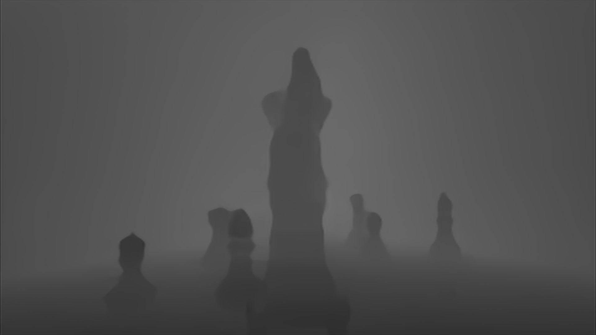
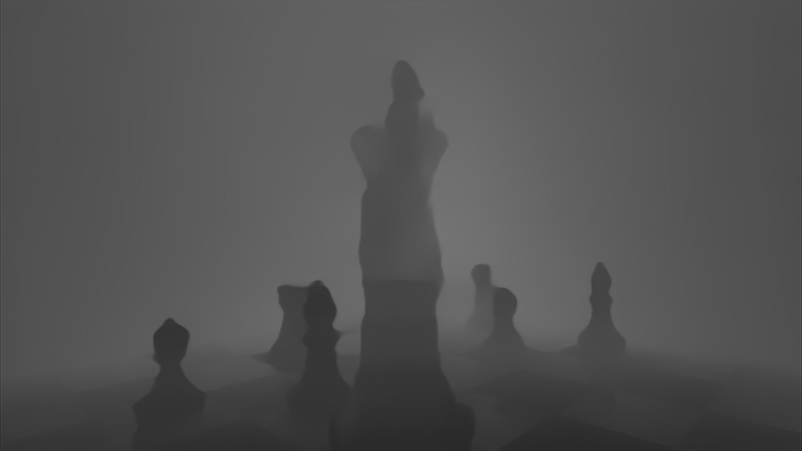
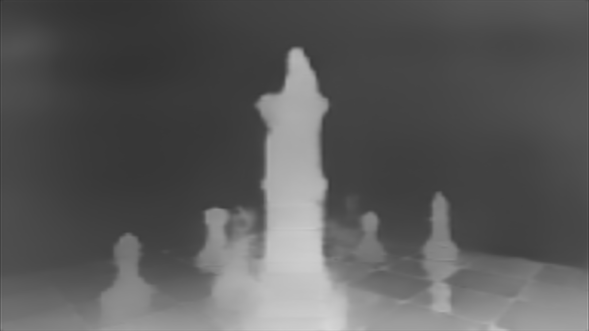
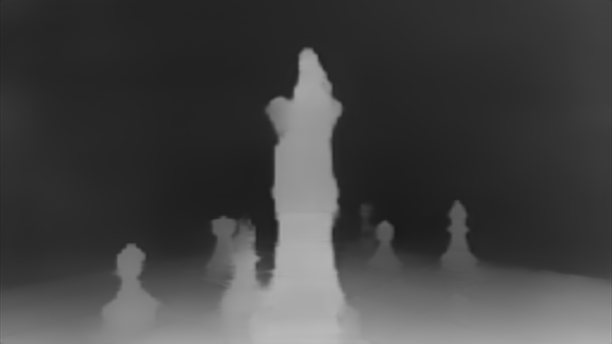
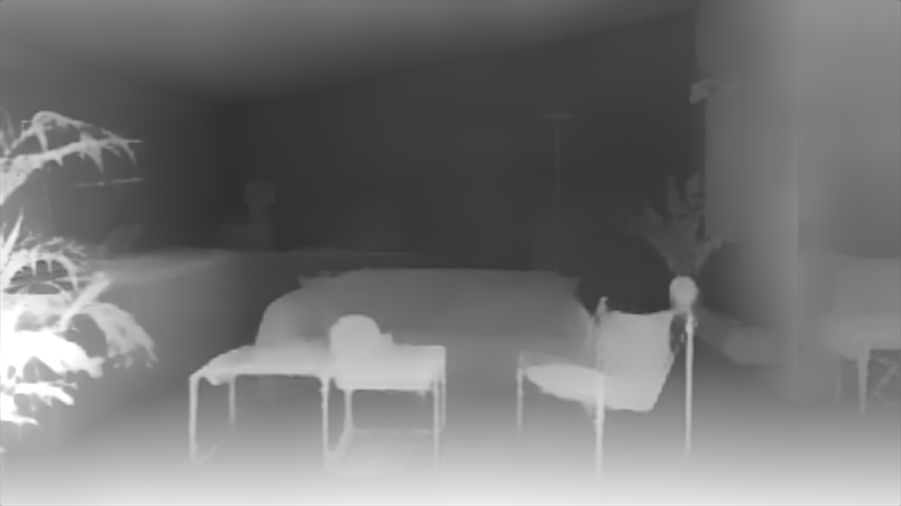
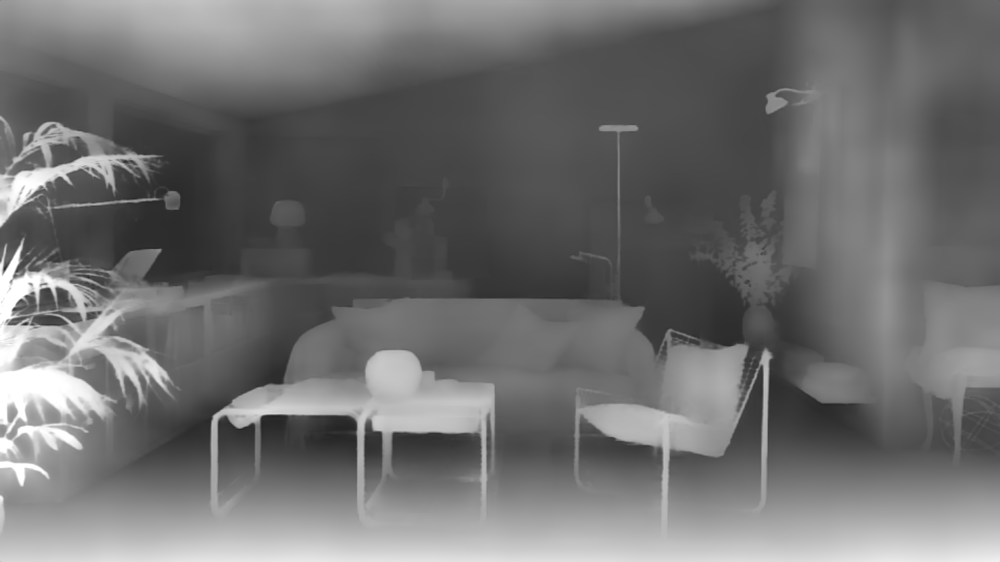
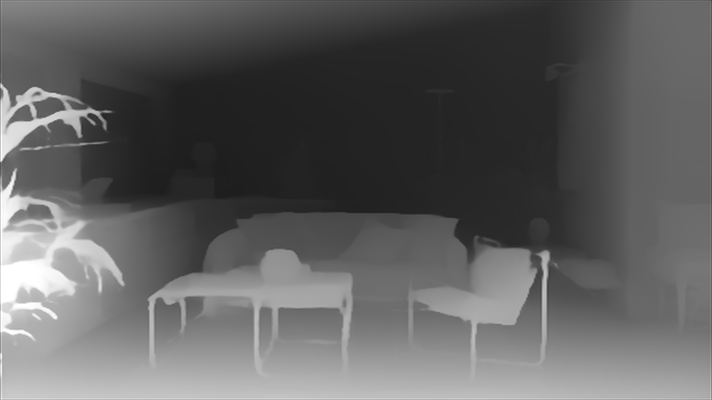
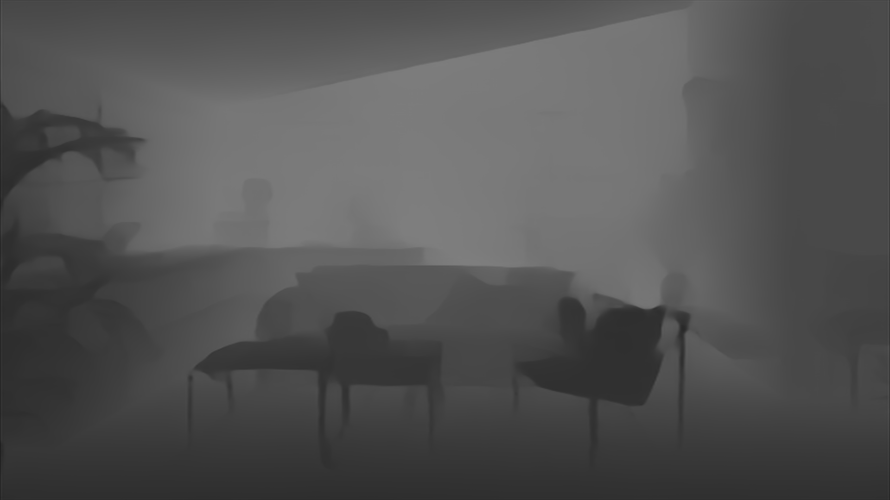

# Realtime depth through MPSGraph on macOS 27

Recorded 2026-09-25 on an Apple M1 Max running macOS 27.0 with Xcode 27.0
(build 27A266a). The MESS realtime session targeted 60 fps and used the
MPSMediaPipe face backend.

See the [full performance comparison](../depth-performance-comparison.md) for
all checked-in realtime captures and the separate standalone harness tables.

## Realtime MPSGraph capture results

ZipDepth had the lowest depth cost in the captured MESS sessions. Depth Anything
V2 held the 60 fps presentation target with a median complete depth-source cost
of 17.23 ms. The user-labelled DA3 Small run was the heaviest and presented at a
56.71 fps median over its 60-frame window. All three rows below used the
MPSGraph backend; this table contains no Core ML measurements.

| MPSGraph engine | Capture duration | Samples | Median model time | Median depth-source time | Median presentation rate |
| --- | ---: | ---: | ---: | ---: | ---: |
| DA3 Small (`DA3_SM_MPS`) | 15.24 s | 16 | 33.77 ms | 32.17 ms | 56.71 fps |
| Depth Anything V2 (`DA2_MPS`) | 29.78 s | 30 | 17.01 ms | 17.23 ms | 60.02 fps |
| ZipDepth Base NPU (`ZIP_MPS`) | 13.52 s | 14 | 5.29 ms | 5.44 ms | 60.00 fps |

Compared with the captured DA3 run, ZipDepth's median model time was about 6.4x
faster and its median complete depth-source time was about 5.9x faster. DA2's
complete depth-source median was about 1.9x faster than captured DA3 and 3.2x
slower than ZipDepth.

## Controlled depth-only MPSGraph sweep

The next batch replaces the loaded, incompletely identified rows above with a
controlled Release run. Every row uses the same prerecorded source and segment,
output dimensions, 60 fps target, and one identical depth-consuming effect or
preset. All other effects, foreground/person analysis, and face analysis are
disabled. Each selection gets a fresh launch, a warm-up period, and a 20-second
`CAPTURE LOG` window. One `SNAP SHOT` is taken after stabilization while the
capture remains active; its absolute PNG path is recorded as a
`capture.snapshot` event for the corresponding example image.

The package target is included because the standard ZipDepth 896 graph now
targets macOS 15, while its FP16 comparison and the other graphs in this batch
target macOS 27. The runtime machine remains macOS 27.

| Run | MPSGraph engine | Fixed input | Graph input | Package target | Artifacts | Median model | Median depth source | Depth-source p90 | Median presentation |
| --- | --- | ---: | --- | --- | --- | ---: | ---: | ---: | ---: |
| M01 | Depth Anything V2 | 448 x 336 | FP32 | macOS 27 | [Raw](captures/DA2_448x336_MPSGRAPH_FP32_CLEAN) / [PNG](../../images/examples/da2-448x336-mpsgraph-fp32-clean.png) | 15.17 ms | 15.35 ms | 15.69 ms | 60.000 fps |
| M02 | Depth Anything V2 | 448 x 336 | FP16 | macOS 27 | [Raw](captures/DA2_448x336_MPSGRAPH_FP16_CLEAN) / [PNG](../../images/examples/da2-448x336-mpsgraph-fp16-clean.png) | 15.22 ms | 15.38 ms | 15.76 ms | 60.008 fps |
| M03 | Depth Anything 3 Small | 392 x 392 | FP32 | macOS 27 | [Raw](captures/DA3_392x392_MPSGRAPH_FP32_CLEAN) / [PNG](../../images/examples/da3-392x392-mpsgraph-fp32-clean.png) | 15.40 ms | 15.54 ms | 15.75 ms | 59.998 fps |
| M04 | Depth Anything 3 Small | 518 x 518 | FP32 | macOS 27 | [Raw](captures/DA3_518x518_MPSGRAPH_FP32_CLEAN) / [PNG](../../images/examples/da3-518x518-mpsgraph-fp32-clean.png) | 48.71 ms | 49.79 ms | 52.66 ms | 60.077 fps |
| M05 | ZipDepth Base NPU | 384 x 384 | FP32 | macOS 27 | [Raw](captures/ZIP_384x384_MPSGRAPH_FP32_CLEAN) / [PNG](../../images/examples/zipdepth-384x384-mpsgraph-fp32-clean.png) | 5.63 ms | 5.78 ms | 6.44 ms | 59.995 fps |
| M06 | ZipDepth Base NPU | 384 x 384 | FP16 | macOS 27 | [Raw](captures/ZIP_384x384_MPSGRAPH_FP16_CLEAN) / [PNG](../../images/examples/zipdepth-384x384-mpsgraph-fp16-clean.png) | 6.14 ms | 6.37 ms | 6.80 ms | 59.996 fps |
| M07 | ZipDepth Base NPU | 512 x 512 | FP32 | macOS 27 | [Raw](captures/ZIP_512x512_MPSGRAPH_FP32_CLEAN) / [PNG](../../images/examples/zipdepth-512x512-mpsgraph-fp32-clean.png) | 7.67 ms | 7.84 ms | 8.49 ms | 59.991 fps |
| M08 | ZipDepth Base NPU | 672 x 384 | FP32 | macOS 27 | [Raw](captures/ZIP_672x384_MPSGRAPH_FP32_CLEAN) / [PNG](../../images/examples/zipdepth-672x384-mpsgraph-fp32-clean.png) | 8.07 ms | 8.26 ms | 8.86 ms | 59.989 fps |
| M09 | ZipDepth Base NPU | 896 x 512 | FP32 | macOS 15 | Pending | — | — | — | — |
| M10 | ZipDepth Base NPU | 896 x 512 | FP16 | macOS 27 | Pending | — | — | — | — |
| M11 | ZipDepth Base NPU | 1536 x 864 | FP32 | macOS 27 | Pending | — | — | — | — |
| M12 | ZipDepth Base NPU | 1536 x 864 | FP16 | macOS 27 | Pending | — | — | — | — |
| M13 | ZipDepth Base NPU | 1920 x 1088 | FP32 | macOS 27 | [Raw](captures/ZIP_1920x1088_MPSGRAPH_FP32_CLEAN) / [PNG](../../images/examples/zipdepth-1920x1088-mpsgraph-fp32-clean.png) | 43.23 ms | 44.27 ms | 46.60 ms | 59.906 fps |
| M14 | ZipDepth Base NPU | 1920 x 1088 | FP16 | macOS 27 | [Raw](captures/ZIP_1920x1088_MPSGRAPH_FP16_CLEAN) / [PNG](../../images/examples/zipdepth-1920x1088-mpsgraph-fp16-clean.png) | 43.63 ms | 44.86 ms | 46.44 ms | 59.429 fps |

The operational checklist and exact App Settings labels are in the
[Realtime Depth Test TODO List](../../TEST_TODO_LIST.md). Once captures are
available, accept each row only after its `capture.configuration` event matches
the expected backend, variant, input type, and dimensions.

The controlled application results do not reproduce the earlier isolated
ZipDepth 384 FP16 gain. At 384 x 384, FP16 increased median complete-path
latency by `10.2%` versus FP32. At 1920 x 1088, FP16 increased the median by
`1.3%`; the p90 was effectively tied, while median presentation was lower.
At DA2 448 x 336, FP16 changed median complete-path latency from `15.35 ms` to
`15.38 ms`, an effectively tied `0.2%` increase. FP32 is therefore the current
preferred graph input for all three captured FP32/FP16 pairs.

## Depth-only Core ML validation

These accepted Core ML controls recorded no foreground or face timing fields,
ended normally with zero dropped events, and resolved their snapshot events to
valid 1920 x 1080 PNG files. ZipDepth Core ML uses the application's workload
policy; the capture does not record the device placement selected by Core ML.

| Route | Duration / samples | Model median / p90 / p99 | Depth-source median / p90 / p99 | Presentation | Example |
| --- | ---: | ---: | ---: | ---: | --- |
| [DA2 448 Core ML](captures/DA2_448x336_COREML_CLEAN) | 32.60 s / 33 | 15.93 / 16.32 / 16.61 ms | 16.68 / 17.95 / 21.26 ms | 59.996 fps |  |
| [DA3 392 Core ML](captures/DA3_392x392_COREML_CLEAN) | 23.47 s / 24 | 15.18 / 15.74 / 17.52 ms | 16.43 / 16.86 / 19.00 ms | 60.006 fps |  |
| [DA3 518 Core ML](captures/DA3_518x518_COREML_CLEAN) | 32.18 s / 32 | 44.73 / 53.55 / 58.00 ms | 48.61 / 54.71 / 61.09 ms | 60.003 fps |  |
| [ZipDepth 384 Core ML](captures/ZIP_384x384_COREML_CLEAN) | 33.90 s / 34 | 7.44 / 7.62 / 7.70 ms | 8.24 / 8.62 / 11.24 ms | 60.007 fps |  |
| [ZipDepth 512 Core ML](captures/ZIP_512x512_COREML_CLEAN) | 33.85 s / 34 | 9.65 / 10.33 / 10.58 ms | 11.29 / 12.27 / 12.52 ms | 60.003 fps |  |
| [ZipDepth 672 Core ML](captures/ZIP_672x384_COREML_CLEAN) | 32.62 s / 33 | 9.69 / 10.11 / 10.61 ms | 10.80 / 11.59 / 12.26 ms | 59.996 fps |  |
| [ZipDepth 896 Core ML](captures/ZIP_896x512_COREML_CLEAN) | 34.20 s / 35 | 9.57 / 10.02 / 11.04 ms | 10.86 / 11.65 / 12.32 ms | 60.007 fps |  |
| [ZipDepth 1920 Core ML](captures/ZIP_1920x1088_COREML_CLEAN) | 33.80 s / 34 | 60.68 / 61.07 / 61.41 ms | 61.70 / 61.98 / 62.29 ms | 60.000 fps |  |

Against the Core ML controls, MPSGraph FP32 reduced median complete-path
latency by `8.0%` for DA2, `29.9%` for ZipDepth 384, `30.6%` for ZipDepth 512,
`23.5%` for ZipDepth 672, and `28.3%` for ZipDepth 1920. Two supplied 672
Core ML captures were duplicates, so only the first was kept.

For DA3, MPSGraph reduced the 392 x 392 complete-path median by `5.5%` versus
Core ML. At 518 x 518, Core ML had a `2.4%` lower median, but MPSGraph improved
p90 from `54.71 ms` to `52.66 ms` and p99 from `61.09 ms` to `53.77 ms`.

## How the realtime capture was measured

MESS instrumented each completed depth request while its diagnostic capture was
active. For MPSGraph, model time spans graph encoding through the graph completion
callback and can include queued preprocessing dependencies. Complete depth-source
time runs from the app worker's request start through the completed graph result;
the graph realtime path reports only after its final GPU command buffer finishes.

The capture wrote the latest timing values approximately once per second as fps
equivalents computed by `1000 / operation_ms`. The summarizer:

1. reads `streams/engine-stats.jsonl`;
2. excludes the initial sample where `elapsed_s < 1`;
3. converts each operation's sampled fps equivalent back to milliseconds; and
4. takes the median of those per-sample milliseconds. Presentation rate remains
   the median of its sampled fps values.

These values describe sampled operation latency. They are not counts of delivered
depth frames. The presentation rate is MESS's rolling 60-frame presentation
average sampled at the same interval. Model and depth-source fields are updated
by adjacent callbacks and sampled independently, so their medians can appear
slightly out of order.

Run the checked-in summarizer against a raw capture with:

```sh
python3 scripts/summarize_capture.py \
  studies/realtime-depth-macos27/captures/DA2_MPS
```

## Loaded FP16 input comparison

Four later captures compared DA2 448 x 336 and ZipDepth 1536 x 864 with
planar FP32 and FP16 MPSGraph inputs under active foreground and face analysis.
DA2 was tied: FP16 changed median complete depth-source latency from `29.56 ms`
to `29.62 ms`. ZipDepth FP16 reduced it from `29.46 ms` to `28.27 ms`, a
`4.1%` median reduction, while the p90 remained tied near `31.8 ms`.

These are single loaded captures with variable face count. The capture did not
record the source segment, exact effect workload, memory, or delivered depth
counts. See the [full loaded comparison and raw capture links](loaded-fp16-comparison-2026-09-28.md).

A second loaded ZipDepth batch added 512 x 512 and 672 x 384 FP32 observations
and a paired 896 x 512 comparison. At 896, FP16 reduced the median complete
depth-source time from `8.72 ms` to `8.18 ms` (`6.2%`) while both variants held
a 60 fps presentation median. Its complete-path p90 and p99 were worse, so a
controlled repeat is still needed. See the
[second-batch report and raw captures](loaded-zipdepth-batch-2-2026-09-28.md).

## Limits on comparison

This was not a controlled replay. The DA3 capture saw zero to four faces per
sample with 38.86 ms median face latency. DA2 saw zero to two faces with 21.52 ms
median face latency. ZipDepth saw one to two faces with 9.13 ms median face
latency. DA2 and DA3 each recorded one source-frame decode failure.

Foreground model time remained in the same range: 17.78 ms for DA3, 19.71 ms for
DA2, and 18.01 ms for ZipDepth. That supports attributing the large depth timing
differences to the depth backends, while the presentation-rate difference remains
directional.

Capture metadata did not record the selected depth model or backend. The row
identities therefore come from the user-assigned directory names. In particular,
the DA3 capture does not prove whether the 392 x 392 or 518 x 518 variant was
active.

## Qualitative fixed-shape samples

These user-supplied 1920 x 1080 MESS renders show the current fixed-shape model
options. The five ZipDepth rows use ZipDepth Base NPU. The DA2 and DA3 rows use
Depth Anything V2 Small and Depth Anything 3 Small, respectively. The rendered
treatment, source material, and surrounding effect chain contribute to the
visible result, so these are qualitative samples rather than controlled
raw-depth accuracy comparisons.

The original six capture filenames record the model family and fixed shape, but
not the selected Core ML or MPSGraph backend. The later 1920 x 1088 sample was
explicitly recorded as MPSGraph. No backend comparison should be inferred from
these rendered samples alone.

| Model | Fixed shape | Model pixels | Backend | Sample |
| --- | ---: | ---: | --- | --- |
| ZipDepth Base NPU | 384 x 384 | 147,456 | Not recorded |  |
| ZipDepth Base NPU | 512 x 512 | 262,144 | Not recorded |  |
| ZipDepth Base NPU | 672 x 384 | 258,048 | Not recorded |  |
| ZipDepth Base NPU | 896 x 512 | 458,752 | Not recorded |  |
| ZipDepth Base NPU | 1920 x 1088 | 2,088,960 | MPSGraph |  |
| Depth Anything V2 Small | 448 x 336 | 150,528 | Not recorded |  |
| Depth Anything 3 Small | 518 x 518 | 268,324 | Not recorded |  |

## Standalone DA2 compute-unit comparisons

The DA2 Core ML compute-unit results came from synchronous still-image harnesses,
not the realtime MESS captures above. Both comparisons used the same custom
`DepthAnythingV2SmallRealtime` package at 448 x 336 and an MPSGraph executable
compiled with `.level0`. Input preparation and output readback were outside the
timed calls.

| Comparison | Core ML compute units | Source and sampling | Core ML median | Paired MPSGraph median |
| --- | --- | --- | ---: | ---: |
| GPU | `.cpuAndGPU` | Eight images (`demo04`, `demo05`, `demo10`, `demo13`–`demo17`); seven interleaved predictions per backend per image, first two discarded; median of the eight per-image medians | 14.86 ms | 14.50 ms |
| Neural Engine | `.cpuAndNeuralEngine` | `demo02`; 32 interleaved predictions per backend, first 12 discarded | 23.01 ms | 15.51 ms |

The GPU comparison produced zero absolute output difference across all 11 images
used during its broader numerical validation, including the three initial images
that were not included in the timing aggregate. The Neural Engine comparison was
not bit-identical: MAE was 0.00425, RMSE was 0.00873, and maximum absolute
difference was 0.18555, with no nonfinite values.

`.cpuAndNeuralEngine` configures the devices Core ML may use; it does not prove
that every operation ran on the Neural Engine. These standalone comparisons were
performed on the M1 Max under macOS 26.5.2 with Xcode 26.6 and predate the macOS
27 realtime captures. They are useful evidence about the relative DA2 routes,
but are not directly comparable with the realtime table. Current MESS builds use
`.cpuAndGPU` for DA2 Core ML and no longer switch that model to
`.cpuAndNeuralEngine` when other Vision workloads change. The original harness
and raw per-call timing samples are not included in this repository; the table
preserves its recorded protocol and aggregate results.

## Other standalone conversion measurements

These warm medians came from different small harnesses and exclude the full MESS
pipeline. Compare routes within a row more strongly than values between rows.

| Model | Fixed input | Core ML CPU + GPU | MPSGraph `.level0` | Context |
| --- | ---: | ---: | ---: | --- |
| ZipDepth Base NPU | 384 x 384 | 12.96 ms | 3.48 ms | Preliminary raw-model probes |
| DA3 Small native | 518 x 518 | 23.94 ms | 40.4 ms | Core ML validator and separate graph probe |
| DA3 Small reduced | 392 x 392 | 16.69 ms | 15.22 ms | Core ML validator and separate graph probe |

## Deployment-target finding

The three Depth Anything Core ML sources fail `mpsgraphtool` conversion for
macOS 26 and earlier. Their generated instance-normalization operation uses
mean, variance, gamma, and beta operands available from MPSGraph package target
version 1.3.8; Xcode 27 maps macOS 26 to 1.3.3 and macOS 15 to 1.2.1. They convert
successfully with a macOS 27 target. This restriction applies to the generated
MPSGraph packages. All four Core ML source packages support macOS 15: DA2 and
ZipDepth use the Core ML specification target corresponding to macOS 13, and DA3
uses the target corresponding to macOS 15.

ZipDepth converts successfully with a macOS 15 target. The release keeps its
macOS 27 build so every artifact matches the benchmark configuration. A future
lower-target ZipDepth release should be tested on the oldest claimed system.

See [MPSGraph deployment compatibility](compatibility.md) for the full tested
matrix, reproduced diagnostics, build-versus-runtime distinction, reproduction
command, and possible lower-target approaches.

## Measurements after the depth-only sweep

Use the controlled MPSGraph batch to choose the resolutions and FP32/FP16 pairs
worth retaining. Then measure their direct Core ML controls under the same
depth-only contract. A later DA2 compute-unit diagnostic can use separate
launches for fixed `.cpuAndGPU` and explicit `.cpuAndNeuralEngine`; production
DA2 should remain fixed to `.cpuAndGPU` unless new measurements reverse the
existing result.

The stats stream should eventually record depth request, completion, and
superseded-request deltas so delivered depth cadence can be measured directly.
Until those fields exist, report these captures as sampled latency and
presentation-rate measurements rather than delivered depth fps.
